# Nuclear Reactor Simulator — Manuale utente educativo e operativo

**Edizione di riferimento:** baseline validata M10.9.4 — *Subsystem Engineering Schematics*, con hardening di leggibilità UI e stampa  
**Lingua:** Italiano  
**Destinazione:** formazione, comprensione del ciclo d'impianto, uso del simulatore e addestramento operativo  

> **Importante**  
> Nuclear Reactor Simulator è un simulatore **educativo**. Riproduce in forma deterministica e semplificata molti fenomeni di un impianto nucleare ad acqua con circuito di ricircolo, separazione vapore, turbina, condensatore e generatore. Non è un simulatore di progetto, autorizzazione o sicurezza nucleare e non deve essere usato come riferimento per la conduzione di un impianto reale.

## Nota sulla lingua e sui nomi mostrati dal software

Il software utilizza molte etichette in inglese, mentre questo manuale spiega i concetti in italiano. Per evitare confusione si applicano queste regole:

- le diciture in **MAIUSCOLO** o racchiuse tra apici inversi, come `SPEED RAISE`, sono riportate esattamente come compaiono nell'interfaccia;
- nel testo si usa il termine tecnico italiano, seguito dall'inglese tra parentesi alla prima occorrenza quando è utile;
- la parola **collettore** traduce *header* e non indica il corpo cilindrico di separazione acqua-vapore;
- **frazione di vuoto** indica la parte di volume occupata dalle bolle di vapore nel refrigerante;
- **vuoto del condensatore** indica invece la bassa pressione mantenuta nel condensatore. Sono due grandezze diverse;
- alcune sigle restano in inglese perché sono denominazioni tecniche consolidate o nomi propri delle funzioni del simulatore.

| Sigla | Significato | Spiegazione semplice |
|---|---|---|
| **SCRAM** | Arresto rapido del reattore | Inserzione rapida delle barre di controllo per fermare la reazione a catena. |
| **MCP** | *Main Circulation Pump* | Pompa principale di circolazione del refrigerante nel nocciolo. |
| **HMI** | *Human-Machine Interface* | Interfaccia uomo-macchina: pannelli, indicatori e comandi usati dall'operatore. |
| **UA** | Conduttanza globale di scambio termico | Misura complessiva della capacità del condensatore di trasferire calore. |
| **NPSH** | Margine di pressione all'aspirazione | Grandezza usata per valutare il rischio di cavitazione di una pompa; nel modello corrente non è ancora rappresentata completamente. |

Per ritrovare rapidamente una dicitura del software, consultare l'**Appendice A — Dizionario inglese ↔ italiano**.

---

# Indice

1. **Come usare questo manuale**
2. **Il reattore in un colpo d'occhio**
3. **Fisica di base indispensabile**
   - 3.1 Fissione, neutroni e reazione a catena
   - 3.2 Criticità e reattività
   - 3.3 Neutroni ritardati e periodo del reattore
   - 3.4 Potenza termica e calore residuo
   - 3.5 Temperatura, pressione e trasferimento di calore
   - 3.6 Acqua, vapore e cambiamento di fase
   - 3.7 Portata, pompe, valvole e differenze di pressione
   - 3.8 Turbina, coppia, velocità e potenza meccanica
   - 3.9 Generatore, frequenza, fase e sincronizzazione
   - 3.10 Retroazioni di temperatura, frazione di vuoto e xeno
   - 3.11 Conservazione di massa ed energia
4. **I grandi flussi dell'impianto**
   - 4.1 Flusso neutronico e di reattività
   - 4.2 Flusso termico
   - 4.3 Flusso dell'acqua e del vapore
   - 4.4 Flusso dell'energia meccanica ed elettrica
   - 4.5 Flusso dei segnali, controlli, protezioni e allarmi
5. **Catalogo completo dei componenti**
   - 5.1–5.25 Nocciolo, barre, cinetica, circuito di ricircolo, corpo cilindrico, vapore, turbina, condensatore, acqua di alimentazione, generatore, strumentazione, controlli, protezioni e allarmi
6. **Intervalli, valori di riferimento, limiti e come interpretarli**
7. **Allarmi, protezioni, interblocchi e risposta dell'operatore**
8. **Operazioni classiche**
   - 8.1 Metodo generale prima di ogni manovra
   - 8.2 Avvio da arresto a freddo
   - 8.3 Prima criticità e bassa potenza
   - 8.4 Riscaldamento e produzione di vapore
   - 8.5 Avviamento turbina
   - 8.6 Sincronizzazione alla rete
   - 8.7 Aumento del carico
   - 8.8 Riduzione del carico
   - 8.9 Apertura interruttore di gruppo e scarico generatore
   - 8.10 Arresto normale del reattore
   - 8.11 Scatto e recupero controllato
9. **Il pannello di controllo**
   - 9.1 Struttura generale
   - 9.2 Comandi globali
   - 9.3 Indicatori globali
   - 9.4 Aree di lavoro
   - 9.5 Colori e indicatori
   - 9.6 Indicatori, bande e riferimenti grafici
   - 9.7 Context Inspector
   - 9.8 Plant Overview
   - 9.9 Reactor & Core
   - 9.10 Primary Circuit
   - 9.11 Turbine & Secondary Cycle
   - 9.12 Generator & Grid
   - 9.13 Alarms & Events
10. **Operator Computer — F1–F8**
11. **Modalità di assistenza e controllo**
12. **Modalità Gioco: obiettivi, punteggio e strategia**
13. **Sessioni, punti di ripristino, riesecuzioni deterministiche e salvataggi**
14. **Metodo di diagnosi dell'impianto**
15. **Glossario essenziale**
16. **Limiti noti e semplificazioni del modello**
17. **Schede rapide operative**

---

# 1. Come usare questo manuale

Questo manuale può essere letto in tre modi.

### Per imparare come funziona una centrale

Leggere nell'ordine i capitoli **2, 3 e 4**. L'obiettivo è costruire un modello mentale semplice:

**fissione → calore → acqua/vapore → turbina → generatore → rete → condensatore → ritorno dell'acqua**.

### Per imparare a usare il simulatore

Leggere i capitoli **6, 8, 9 e 10**. Qui vengono spiegati:

- cosa significano gli indicatori;
- quali comandi sono disponibili;
- come avviare, sincronizzare, caricare e arrestare l'impianto;
- come comportarsi con allarmi e scatti.

### Per giocare e ottenere un buon punteggio

Leggere i capitoli **11, 12 e 17**.

Il principio più importante è sempre lo stesso:

> **Non comandare un componente guardandolo isolatamente. Osserva prima quale effetto avrà sull'intera catena energetica.**

### Convenzione grafica per lettura e stampa

Gli schemi e i flowchart di questo manuale rispettano un limite di **massimo quattro elementi sulla stessa riga**. Le catene più lunghe vengono orientate verticalmente oppure suddivise in più passaggi consecutivi. Non si riduce il testo per comprimere più elementi in orizzontale: in stampa devono restare leggibili etichette, frecce e relazioni causali.

---

# 2. Il reattore in un colpo d'occhio

Il simulatore rappresenta un impianto completo nel quale l'energia cambia forma più volte.

**1. Produzione e trasporto del calore**


**2. Conversione in lavoro ed elettricità**

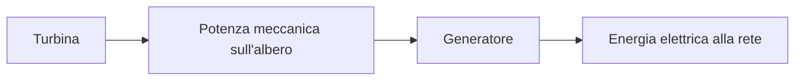

Il vapore prodotto nel passaggio 1 alimenta la turbina; il suo scarico prosegue nel circuito di condensazione.

**3. Condensazione e raccolta**

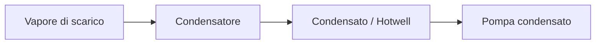

**4. Ritorno dell'acqua al separatore**

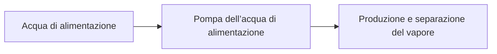

L'impianto può essere immaginato come cinque sistemi collegati.

| Sistema | Compito principale | Grandezze da osservare |
|---|---|---|
| **Reattore** | Produce calore attraverso la fissione | potenza termica, reattività, periodo, barre |
| **Circuito primario / ricircolo** | Porta il calore dal core al corpo cilindrico di separazione acqua-vapore | portata, pressioni, temperature, livello corpo cilindrico |
| **Ciclo vapore** | Trasporta l'energia termica alla turbina | pressione e temperatura vapore, portata |
| **Turbina-condensatore-acqua di alimentazione** | Trasforma calore in lavoro e chiude il ciclo dell'acqua | rpm, potenza albero, pressione condensatore, portate pompe |
| **Generatore e rete** | Trasforma lavoro meccanico in elettricità | frequenza, fase, tensione, interruttore di gruppo, MWe |

## La regola fondamentale: tutto è collegato

Esempio: aumentare il carico elettrico non significa semplicemente “chiedere più MW”.

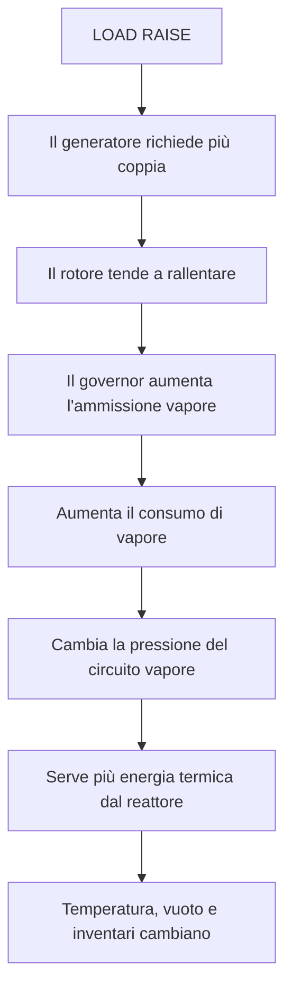

Per questo il buon operatore lavora per **equilibrio** e non per singolo comando.

---

# 3. Fisica di base indispensabile

## 3.1 Fissione, neutroni e reazione a catena

Nel combustibile nucleare alcuni nuclei possono assorbire un neutrone e dividersi. La fissione libera:

- energia sotto forma di calore;
- nuovi neutroni;
- prodotti di fissione.

Alcuni dei neutroni prodotti possono causare nuove fissioni.

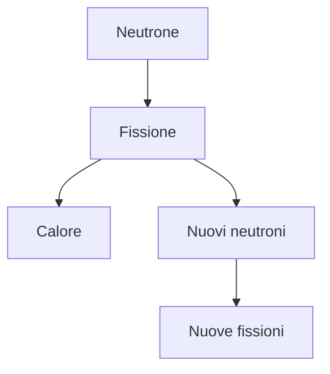

La centrale è controllabile perché non tutti i neutroni hanno lo stesso comportamento e perché la probabilità che essi continuino la catena può essere modificata con barre e retroazione fisici.

## 3.2 Criticità e reattività

La **reattività** indica quanto il sistema tende ad aumentare o diminuire la popolazione neutronica.

- reattività **negativa**: la popolazione neutronica tende a diminuire;
- reattività circa **zero**: il reattore è vicino alla criticità stazionaria;
- reattività **positiva**: la popolazione neutronica tende ad aumentare.

Il simulatore compone la reattività da più contributi:

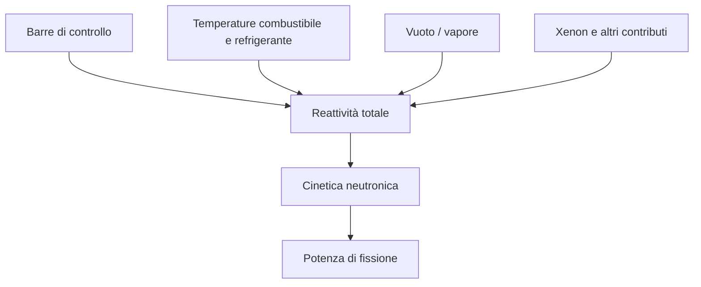

La reattività non è la potenza. È una delle cause che determina **come la potenza cambia nel tempo**.

## 3.3 Neutroni ritardati e periodo del reattore

Una piccola parte dei neutroni utili alla dinamica della reazione appare con ritardo. Questi **neutroni ritardati** rendono possibile una risposta controllabile su scale temporali operative.

Il **periodo del reattore** indica quanto rapidamente la potenza sta cambiando.

In modo intuitivo:

- periodo molto lungo → potenza quasi stabile;
- periodo positivo corto → potenza cresce rapidamente;
- periodo negativo → potenza diminuisce;
- periodo praticamente infinito → condizione quasi stazionaria.

Nel simulatore il periodo è una **diagnostica di modello**, non deve essere confuso con una misura fisica indipendente.

## 3.4 Potenza termica e calore residuo

La fissione genera **potenza termica**. Questa potenza viene depositata nei materiali e nel refrigerante e poi trasportata dal circuito.

La potenza elettrica è solo una parte della potenza termica originaria.

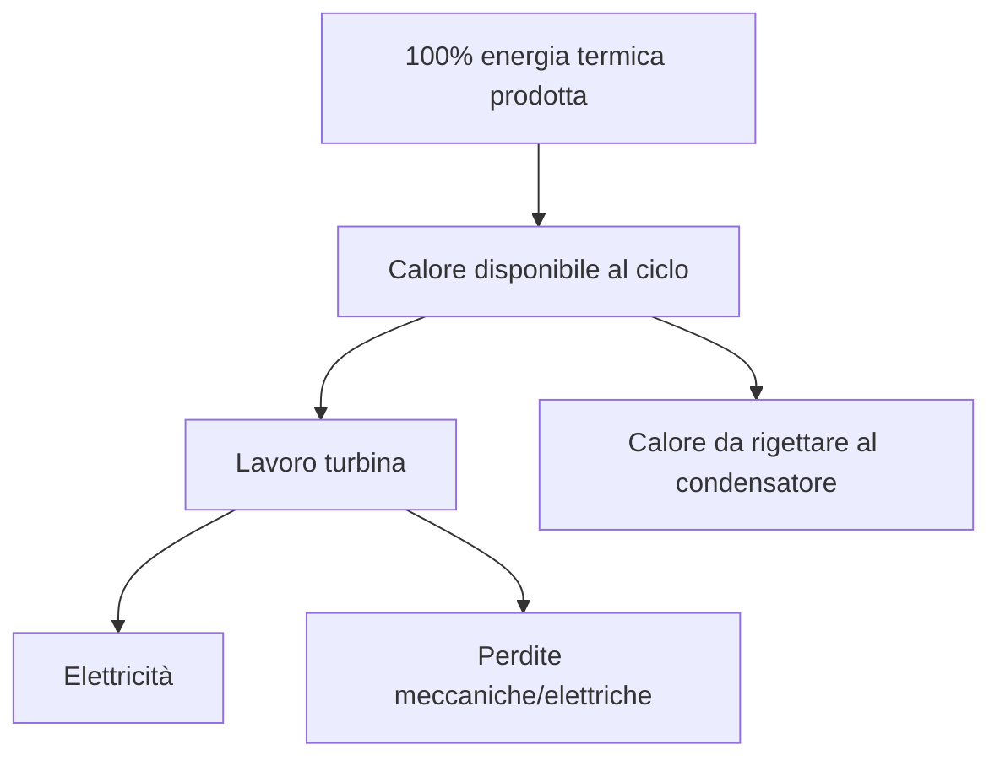

Dopo lo spegnimento della reazione di fissione resta il **decay heat**, cioè il calore prodotto dal decadimento dei prodotti radioattivi. Il simulatore possiede un modello dedicato di calore residuo, anche se non tutti gli scenari integrano ogni sistema reale di rimozione del calore residuo.

## 3.5 Temperatura, pressione e trasferimento di calore

Tre concetti devono essere tenuti separati:

- **temperatura**: indica lo stato termico;
- **pressione**: influenza densità, flusso e condizioni di ebollizione/condensazione;
- **energia**: è la quantità conservata che cambia quando entra o esce calore o lavoro.

Il calore passa spontaneamente da una regione più calda a una più fredda quando esiste un percorso di trasferimento.

Nel condensatore, per esempio:

```text
vapore caldo → superficie di scambio → acqua di raffreddamento più fredda
```

Più è grande la differenza di temperatura disponibile, maggiore può essere la capacità di rigettare calore, entro i limiti del modello e dell'impianto.

## 3.6 Acqua, vapore e cambiamento di fase

Il simulatore distingue in modo semplificato:

- **liquido sottoraffreddato**;
- **miscela satura liquido-vapore**;
- **vapore surriscaldato**.

Nella regione bifase viene utilizzata la **qualità del vapore**, cioè la frazione massica di vapore nella miscela.

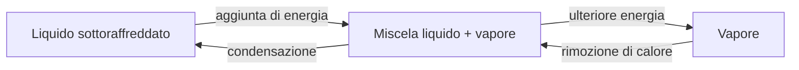

La pressione e la temperatura non sono indipendenti durante la saturazione. Questo è essenziale per capire corpo cilindrico di separazione acqua-vapore e condensatore.

## 3.7 Portata, pompe, valvole e differenze di pressione

Il fluido si muove quando esiste una forza motrice idraulica. Nel modello attuale la portata dei percorsi idraulici è principalmente legata a:

- differenza di pressione;
- resistenza del percorso;
- pressione aggiunta dalle pompe;
- apertura delle valvole.

Una **pompa** crea una spinta di pressione. Una **valvola** non crea portata: modifica la resistenza del percorso.

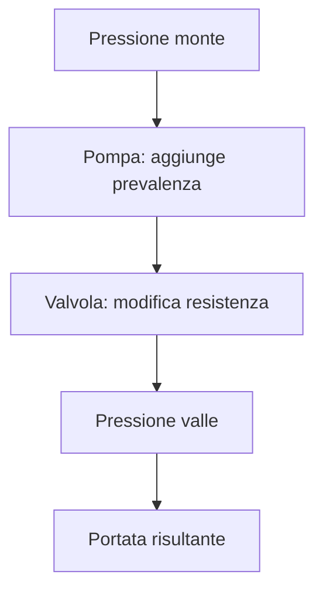

Regola operativa:

> **La posizione di una valvola è una causa; la portata è una conseguenza del sistema completo.**

## 3.8 Turbina, coppia, velocità e potenza meccanica

Il vapore attraversa la turbina e cede parte della propria energia al rotore.

Tre grandezze sono diverse:

- **velocità** del rotore, in rpm;
- **coppia**, cioè la capacità di produrre accelerazione o contrastare un carico;
- **potenza meccanica**, cioè il lavoro trasferito nell'unità di tempo.

Quando la coppia motrice della turbina supera la coppia resistente, il rotore accelera. Quando è inferiore, rallenta.

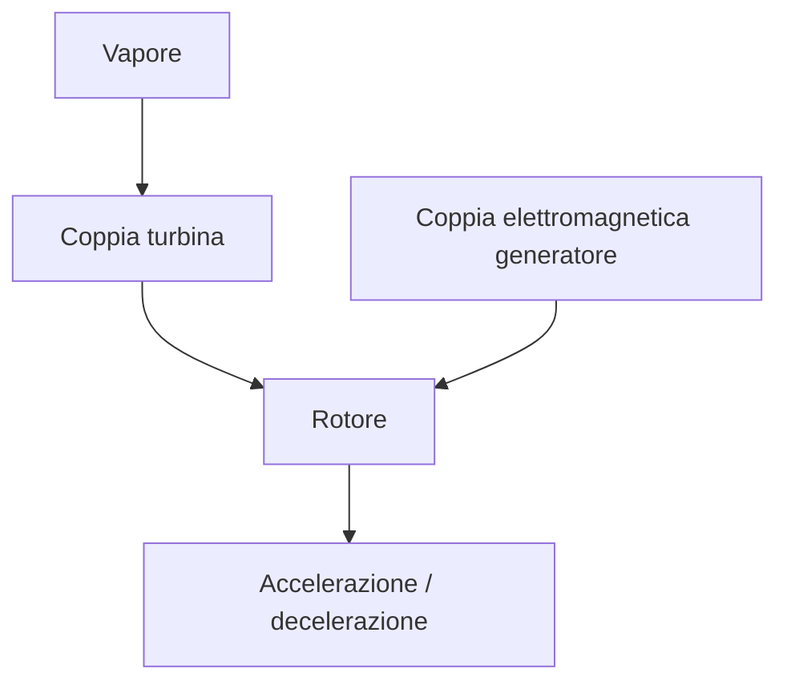

## 3.9 Generatore, frequenza, fase e sincronizzazione

Il generatore converte potenza meccanica in potenza elettrica.

Prima di chiudere l'interruttore verso la rete devono essere compatibili:

- frequenza;
- tensione;
- fase.

Nel riferimento attuale:

- rete: **50 Hz**;
- tensione di linea: **400 kV**;
- velocità sincrona del rotore: circa **3000 rpm**;
- differenza massima di frequenza per la chiusura: **0,2 Hz**;
- differenza massima di fase: **10°**;
- differenza massima di tensione: **10 kV**.

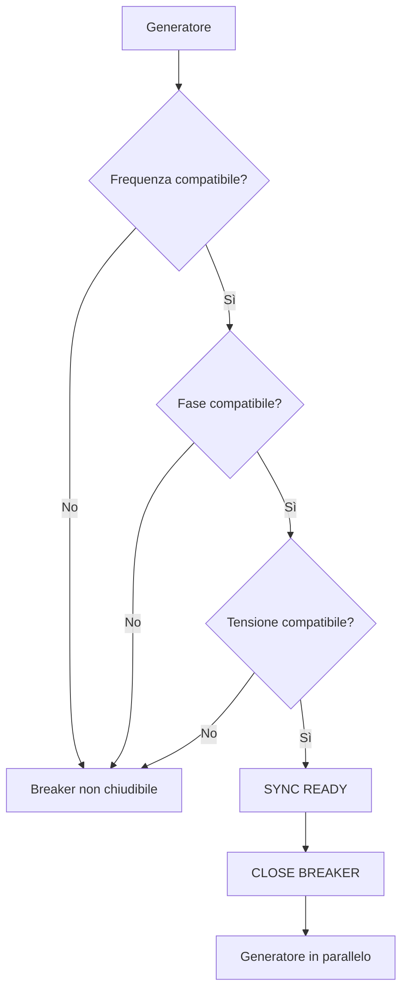

**Permesso dallo scenario** non significa **fisicamente sincronizzabile**. La chiusura resta subordinata alle condizioni elettriche.

## 3.10 Retroazioni di temperatura, frazione di vuoto e xeno

Il reattore non è un sistema a comando lineare. Lo stato fisico modifica a sua volta la reattività.

### Retroazione di temperatura

Quando combustibile o refrigerante cambiano temperatura, cambiano contributi alla reattività secondo il modello configurato.

### Retroazione di vuoto

La formazione di vapore cambia la densità del refrigerante e quindi il contributo di reattività associato al vuoto.

Nel simulatore ispirato a caratteristiche RBMK il retroazione di vuoto è un fenomeno didatticamente importante: un cambiamento termoidraulico può influenzare la potenza neutronica e viceversa.

### Xenon

Lo xenon-135 è un forte assorbitore neutronico. La sua concentrazione dipende dalla storia di potenza e può ostacolare o modificare i transitori di potenza.

Nel simulatore la disponibilità quantitativa della diagnostica xenon dipende dalla configurazione/scenario. Se l'HMI mostra **UNAVAILABLE**, il valore non deve essere inventato o dedotto da altri indicatori.

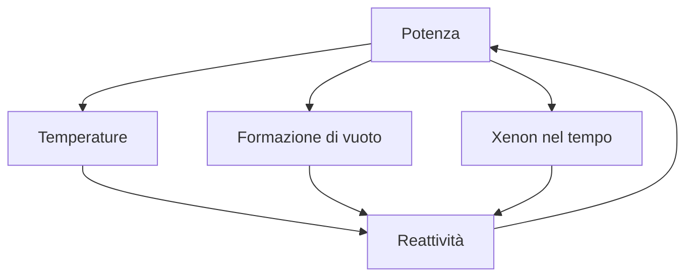

## 3.11 Conservazione di massa ed energia

Un principio centrale del simulatore è che massa ed energia non vengono corrette “a mano” per far tornare i risultati.

Per un ciclo chiuso ideale:

```text
massa che entra in un componente - massa che esce = variazione dell'inventario
```

Per l'energia:

```text
energia in ingresso - energia in uscita = variazione dell'energia immagazzinata
```

Gli audit di conservazione sono fondamentali perché permettono di distinguere:

- un vero transitorio fisico;
- una deriva di inventario;
- un errore numerico;
- un trasferimento energetico non correttamente chiuso.

---

# 4. I grandi flussi dell'impianto

## 4.1 Flusso neutronico e di reattività

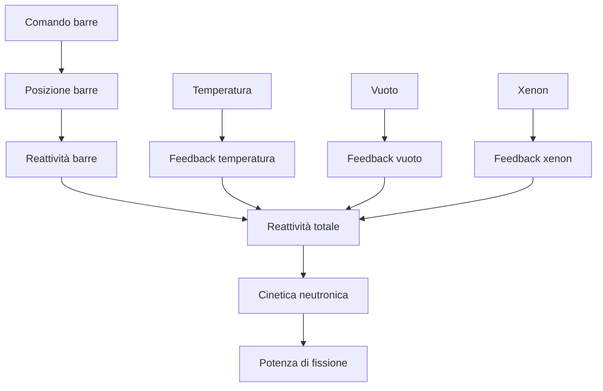

Questo flusso spiega perché il comando **WITHDRAW** non “imposta una potenza”. Cambia la posizione delle barre, che cambia la reattività, che modifica la dinamica neutronica, che infine modifica la potenza.

## 4.2 Flusso termico

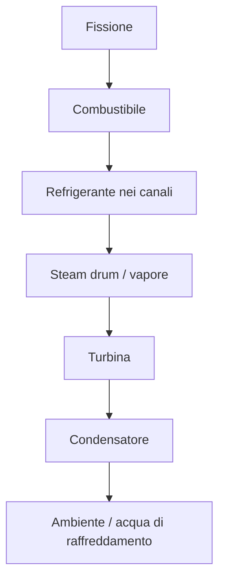

La turbina non consuma tutta l'energia termica. Una grande quantità di calore deve essere rigettata al condensatore.

## 4.3 Flusso dell'acqua e del vapore

Il ciclo idraulico principale del modello è chiuso. Per conservarne la leggibilità in stampa, il percorso completo è diviso in sei passaggi consecutivi.


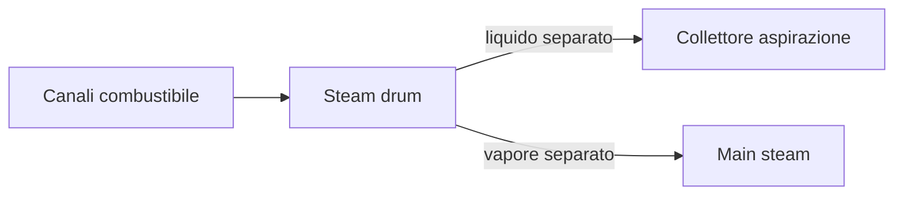

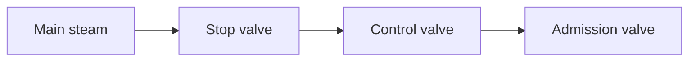


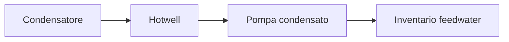

```mermaid
flowchart LR
    FW[Inventario feedwater] --> FP[Pompa dell’acqua di alimentazione]
    FP --> DR[Steam drum]
```

### Percorso liquido primario / ricircolo

1. Il liquido separato nel corpo cilindrico di separazione acqua-vapore ritorna al collettore di aspirazione.
2. La pompa principale aumenta la pressione.
3. Il fluido attraversa i canali riscaldati dal core.
4. La miscela ritorna al corpo cilindrico di separazione acqua-vapore.
5. Lo corpo cilindrico di separazione acqua-vapore separa vapore e liquido.

### Percorso vapore

1. Il vapore separato raggiunge la linea principale.
2. Attraversa il treno di valvole.
3. Entra nella turbina.
4. Cede energia al rotore.
5. Esce verso il condensatore.

### Percorso condensato / acqua di alimentazione

1. Il vapore condensa nella vasca di raccolta del condensato.
2. La pompa di estrazione del condensato trasferisce l'acqua all'inventario acqua di alimentazione.
3. La pompa acqua di alimentazione aumenta la pressione.
4. L'acqua rientra nel corpo cilindrico di separazione acqua-vapore.

## 4.4 Flusso dell'energia meccanica ed elettrica

```mermaid
flowchart TD
    V[Vapore] --> T[Turbina]
    T --> S[Albero / rotore]
    S --> G[Generatore]
    G --> B[Breaker]
    B --> R[Rete]
```

È importante ricordare:

> **Potenza all'albero non significa automaticamente potenza elettrica esportata.**

Per esportare energia servono:

- rotore in condizioni corrette;
- generatore sincronizzato;
- interruttore di gruppo chiuso;
- richiesta di carico;
- sufficiente potenza meccanica dalla turbina.

## 4.5 Flusso dei segnali, controlli, protezioni e allarmi

Il flusso informativo è distinto dal flusso fisico.

```mermaid
flowchart TD
    P[Impianto fisico] --> M[Misure / Instrumentation]
    M --> C[Controller]
    C --> A[Attuatori]
    A --> P
    M --> PR[Protezione]
    PR -->|override prioritario| A
    PR --> AL[Allarmi]
    M --> AL
    AL --> O[Operatore]
    O --> CMD[Comandi]
    CMD --> C
    CMD --> A
```

Ordine di autorità concettuale:

1. **Protezione e interblocco**;
2. controlli automatici/locali;
3. automazione supervisoria, quando attiva;
4. comandi normali dell'operatore.

L'operatore non può usare l'HMI per aggirare una protezione fisica o un consenso.


# 5. Catalogo completo dei componenti

## Come leggere le schede

Ogni scheda usa queste voci:

- **Funzione**: perché il componente esiste;
- **Ingresso**: massa, energia, segnali o comandi che riceve;
- **Uscita**: cosa trasferisce al sistema successivo;
- **Controllo**: chi può modificarne il comportamento;
- **Intervallo / limiti**: solo valori realmente definiti dal modello o dal riferimento corrente;
- **Effetti sul resto dell'impianto**: principali accoppiamenti;
- **Cosa osservare**: indicatori più utili per l'operatore.

> I valori indicati come **riferimento corrente** descrivono la configurazione educativa attuale. Non sono dati di un impianto reale e non devono essere interpretati come limiti ingegneristici universali.

---

## 5.1 Nocciolo e zone del core

**Funzione**  
Il nocciolo è la sorgente primaria di energia. La fissione produce potenza termica che viene depositata nel combustibile e trasferita al refrigerante.

**Ingresso**

- reattività totale;
- popolazione neutronica e precursori ritardati;
- posizione delle barre;
- retroazione di temperatura, vuoto e, quando disponibile, xenon;
- stato termico del combustibile e del refrigerante.

**Uscita**

- potenza di fissione;
- calore verso il circuito;
- diagnostiche per zona: quota di potenza, temperatura combustibile, temperatura refrigerante, vuoto.

**Controllo**

Principalmente attraverso le **barre di controllo**. La potenza non viene impostata direttamente.

**Riferimenti del modello**

- calibrazione termica di riferimento: **100 MWth** alla popolazione neutronica relativa di riferimento;
- banda didattica di bassa potenza per l'esercizio di prima criticità: **0,01–5 MWth**;
- il core di riferimento è aggregato in una zona principale con un gruppo equivalente di **100 canali**.

**Effetti sul resto dell'impianto**

Più potenza termica significa maggiore riscaldamento del refrigerante, maggiore produzione di vapore e maggiore potenziale potenza alla turbina. Ma significa anche variazioni di temperatura e vuoto che ritornano come retroazione sulla reattività.

**Cosa osservare**

- REACTOR THERMAL POWER;
- TOTAL REACTIVITY;
- REACTOR PERIOD;
- temperature fuel/coolant delle zone;
- VOID;
- stato protezione.

---

## 5.2 Barre di controllo

**Funzione**  
Modificano la reattività assorbendo neutroni in misura dipendente dalla posizione.

**Convenzione di posizione**

- **0% withdrawn** = barra completamente inserita;
- **100% withdrawn** = barra completamente estratta.

**Comandi**

- **INSERT**: inserimento;
- **HOLD**: arresto del movimento;
- **WITHDRAW**: estrazione.

Il comando di movimento è persistente: la barra continua nel modo scelto finché non riceve un altro comando o raggiunge un estremo meccanico.

**Riferimento corrente**

- posizione meccanica: **0–100%**;
- velocità della barra di riferimento: circa **10 punti percentuali di corsa al secondo**;
- nella configurazione educativa corrente il punto medio, circa 50%, è usato come riferimento di worth nullo nel seed operativo specifico; la relazione completa posizione-reattività dipende dalla curva di worth.

**Effetti**

```mermaid
flowchart TD
    A[WITHDRAW] --> B[Reattività tende ad aumentare]
    B --> C[Potenza tende a crescere]
    C --> D[Temperatura / vuoto cambiano]
    D --> E[Feedback sulla reattività]
```

**Attenzione**

- il pulsante pieno nell'HMI indica il **modo di movimento effettivamente confermato**, non un semplice pulsante premuto;
- un interblocco può impedire WITHDRAW;
- SCRAM ha autorità superiore e forza l'inserimento delle barre.

---

## 5.3 Cinetica neutronica

**Funzione**  
Trasforma la reattività totale in evoluzione della popolazione neutronica e quindi della potenza.

**Ingresso**

- reattività totale;
- stato dei neutroni ritardati.

**Uscita**

- neutron population;
- reactor period;
- potenza di fissione derivata.

**Controllo**  
Non è controllata direttamente. Risponde ai contributi di reattività.

**Effetti**

Una piccola variazione di reattività può produrre un cambiamento progressivo o rapido della potenza. Per questo, durante la prima criticità, si usano piccoli movimenti e **HOLD** tra un movimento e l'altro.

---

## 5.4 Iodio e xenon

**Funzione**  
Rappresentano la dinamica del veleno neutronico, in particolare lo xenon-135.

**Ingresso**

- storia di potenza;
- produzione e decadimento dei precursori;
- consumo neutronico dello xenon.

**Uscita**

- inventari di iodio/xenon;
- contributo di reattività xenon, quando promosso nello scenario.

**Controllo**  
Nessun comando diretto. È una conseguenza della storia di funzionamento.

**Cosa osservare**

- XENON REACTIVITY se disponibile;
- se compare **UNAVAILABLE**, il simulatore sta dichiarando onestamente che quel dato non è pubblicato in quella configurazione.

**Effetto operativo**  
Dopo variazioni di potenza o arresto, lo xenon può rendere più difficile un successivo aumento di reattività. È un fenomeno lento rispetto ai comandi immediati delle barre.

---

## 5.5 Canali di combustibile

**Funzione**  
Trasportano refrigerante attraverso la regione riscaldata dal core e ricevono il calore nucleare.

**Ingresso**

- acqua dal collettore di mandata;
- potenza termica depositata.

**Uscita**

- acqua più calda o miscela acqua-vapore verso la linea di ritorno e lo corpo cilindrico di separazione acqua-vapore.

**Diagnostiche**

- portata gruppo;
- portata per canale equivalente;
- ΔP;
- fase in uscita;
- qualità del vapore;
- void fraction.

**Effetti**

Una riduzione di portata a pari potenza tende ad aumentare il riscaldamento specifico e può aumentare la formazione di vapore. Il cambiamento di vuoto può modificare la reattività.

---

## 5.6 Collettore di aspirazione

**Funzione**  
Raccoglie il liquido separato di ritorno dal corpo cilindrico di separazione acqua-vapore e alimenta le pompe principali di circolazione.

**Ingresso**

- liquido ricircolato dal corpo cilindrico di separazione acqua-vapore.

**Uscita**

- aspirazione delle MCP.

**Cosa osservare**

- pressione del collettore;
- stato delle pompe;
- continuità della portata del loop.

**Effetti**

Una condizione sfavorevole in aspirazione riduce la capacità del circuito di sostenere la circolazione. Il modello attuale non possiede ancora una rappresentazione completa di NPSH/cavitazione.

---

## 5.7 Pompe principali di circolazione — MCP

**Funzione**  
Mantengono la circolazione forzata del refrigerante nel percorso:

```text
suction header → MCP → pressure header → fuel channels → drum → suction header
```

**Ingresso**

- fluido dal collettore di aspirazione;
- comando START/RUN o STOP;
- velocità/potenza meccanica modellata.

**Uscita**

- aumento di pressione;
- portata nel collettore di mandata.

**Riferimenti correnti**

- comando normalizzato: **0–100%**;
- pompa principale di riferimento: aumento di pressione nominale semplificato di circa **1 MPa** a velocità nominale, soggetto alla curva idraulica del circuito.

**Controllo HMI**

- selezionare **PUMP TARGET**;
- **START / RUN**;
- **STOP**.

Il pulsante pieno rappresenta lo stato effettivamente commesso dal modello.

**Effetti**

- più circolazione migliora il trasporto del calore dal core;
- perdita di circolazione modifica temperature e vuoto;
- fermare una MCP non equivale a “fermare il reattore”: la potenza e il calore residuo devono comunque essere gestiti.

---

## 5.8 Collettore di mandata

**Funzione**  
Distribuisce il refrigerante pressurizzato dalle MCP ai gruppi di canali.

**Ingresso**

- flusso pompato dalle MCP.

**Uscita**

- alimentazione dei canali del core.

**Cosa osservare**

- PRESSURE HEADER;
- HEADER ΔP;
- TOTAL MCP FLOW.

La differenza fra pressione di aspirazione e mandata aiuta a capire se la pompa sta realmente fornendo prevalenza utile.

---

## 5.9 Linee di ritorno

**Funzione**  
Trasportano il fluido riscaldato dai canali al corpo cilindrico di separazione acqua-vapore / collettore di ritorno.

**Ingresso**

- acqua calda o miscela bifase dai canali.

**Uscita**

- inventario dello corpo cilindrico di separazione acqua-vapore.

**Effetti**

Sono il collegamento fra produzione di calore nel core e separazione del vapore. Una variazione di portata o fase si riflette su livello, pressione e produzione di vapore del corpo cilindrico.

---

## 5.10 Corpo cilindrico di separazione acqua-vapore / separatore

**Funzione**  
Riceve la miscela proveniente dai canali e separa:

- vapore verso la linea principale;
- liquido verso il circuito di ricircolo.

Riceve inoltre l'acqua di alimentazione di ritorno dal condensatore.

```mermaid
flowchart TD
    A[Return dai canali] --> D[STEAM DRUM]
    F[Feedwater] --> D
    D -->|vapore separato| S[Main steam]
    D -->|liquido separato| R[Recirculation / suction]
```

**Ingresso**

- ritorno dai canali;
- acqua di alimentazione.

**Uscita**

- vapore separato;
- liquido ricircolato.

**Indicatori**

- DRUM PRESSURE;
- DRUM LEVEL;
- TEMPERATURE · MODEL;
- STEAM FLOW · MODEL;
- RECIRCULATION · MODEL.

**Intervallo e protezioni**

- livello visualizzato: **0–100%** come frazione volumetrica semplificata;
- warning pressione alta: **20 MPa**;
- SCRAM per pressione molto alta: **25 MPa**;
- reset-safe della funzione pressione molto alta: **≤ 24 MPa**.

**Importante sul livello**

Il livello è una rappresentazione aggregata, non una geometria dettagliata del livello reale di un corpo cilindrico di separazione acqua-vapore. Il modello non include ancora swell/shrink completo.

**Effetti**

- troppa produzione di vapore rispetto al acqua di alimentazione riduce l'inventario liquido;
- troppo acqua di alimentazione rispetto all'uscita aumenta l'inventario;
- pressione alta influenza tutto il percorso vapore;
- la corretta chiusura del bilancio fra ritorno, acqua di alimentazione, vapore e ricircolo è essenziale alla stabilità.

---

## 5.11 Linea principale del vapore

**Funzione**  
Trasporta il vapore separato dal corpo cilindrico di separazione acqua-vapore all'header della turbina.

**Ingresso**

- vapore dal corpo cilindrico di separazione acqua-vapore.

**Uscita**

- vapore al treno di ammissione.

**Diagnostiche**

- portata;
- differenza di pressione;
- direzione del flusso.

**Effetti**

Una maggiore richiesta della turbina tende ad aumentare la portata e può modificare pressione del corpo cilindrico/header. L'equilibrio fra produzione e consumo di vapore è uno dei principali accoppiamenti dell'impianto.

---

## 5.12 Valvola di arresto, regolazione e ammissione

Il treno di turbina è:

```text
main steam header → STOP → CONTROL → ADMISSION → turbine inlet
```

### STOP valve

**Funzione:** isolamento rapido della turbina.  
**Protezione:** il turbine scatto forza la chiusura.

### CONTROL valve

**Funzione:** regolazione principale dell'ammissione per la velocità/carico secondo il regolatore di velocità e i controller.  
**Riferimento current-v2:** apertura iniziale del seed di generazione circa **46%**, ma non deve essere trattata come valore universale di esercizio.

### ADMISSION valve

**Funzione:** completa il percorso di ammissione alla turbina e partecipa alla regolazione di pressione nel modello di controllo secondario.

**Intervallo meccanico delle valvole**

- **0% = chiusa**;
- **100% = completamente aperta**.

**Dinamica current-v2**

Le valvole secondarie hanno corsa finita; il riferimento current-v2 usa una velocità massima di circa **50 punti percentuali al secondo**.

**Effetti**

- aprire aumenta la capacità di passaggio ma la portata risultante dipende dall'intera rete;
- chiudere riduce l'ammissione e quindi la potenza della turbina;
- il scatto ha priorità sul comando normale.

---

## 5.13 Turbina e gruppi di stadi

**Funzione**  
Convertono l'energia disponibile nel vapore in lavoro meccanico.

**Ingresso**

- portata vapore;
- pressione e temperatura all'ingresso;
- pressione di scarico del condensatore;
- frazione di vapore disponibile.

**Uscita**

- vapore di scarico;
- potenza e coppia verso il rotore.

**Modello current-v2**

Il lavoro disponibile dipende in forma semplificata da:

- temperatura di ingresso;
- rapporto fra pressione di scarico e pressione di ingresso;
- frazione massica di vapore;
- efficienza dello stadio;
- limite energetico disponibile.

**Indicatori**

- ADMISSION FLOW;
- INLET PRESSURE;
- INLET TEMPERATURE;
- STAGE FLOW;
- STAGE POWER;
- TURBINE SHAFT POWER.

**Effetti**

Una contropressione del condensatore più alta riduce il salto utile di espansione e peggiora il funzionamento della turbina.

---

## 5.14 Rotore e albero

**Funzione**  
Accumula energia cinetica e collega turbina e generatore.

**Ingresso**

- coppia della turbina;
- coppia resistente del generatore.

**Uscita**

- velocità di rotazione;
- potenza meccanica disponibile al generatore.

**Riferimenti correnti**

- velocità nominale/sincrona: **3000 rpm**;
- overspeed scatto current-v2: **3300 rpm**;
- condizione reset-safe overspeed: **≤ 3150 rpm**;
- momento d'inerzia del modello: **1000 kg·m²**.

**Nota sulla scala**

La scala nominale generatore/inerzia è oggetto di revisione progettuale. Per l'operatore conta il target operativo dello scenario, non la targa massima teorica del componente.

---

## 5.15 Condensatore

**Funzione**  
Condensa il vapore di scarico della turbina e rigetta calore verso il boundary di raffreddamento.

**Ingresso**

- vapore di scarico dalla turbina;
- capacità di rimozione del calore del sistema di raffreddamento.

**Uscita**

- condensato verso vasca di raccolta del condensato;
- calore rigettato all'esterno.

```mermaid
flowchart LR
    A[Vapore turbina] --> B[Steam space condensatore]
    B -->|condensazione| C[Hotwell]
    B -->|calore| D[Cooling boundary]
```

**Indicatori**

- PRESSURE · MEASURED;
- VACUUM · MEASURED;
- HOTWELL MASS · MEASURED;
- condensation flow;
- heat rejection power;
- fase dello steam space.

**Protezione current-v2**

- warning contropressione alta: **≥ 20 kPa assoluti**;
- turbine + generator scatto: **≥ 30 kPa assoluti**;
- reset-safe: **≤ 20 kPa assoluti**.

**Interpretazione del vuoto**

Più bassa è la pressione assoluta del condensatore, maggiore è il vuoto e, in generale, migliore è il potenziale salto di espansione della turbina.

### Energia del condensato nel modello current-v2

Nel comportamento current-v2 validato con C.1, il condensato che passa dallo spazio vapore alla vasca di raccolta non viene più assunto automaticamente alla stessa energia dell'acqua già presente nella vasca. Il modello current-v2 ricava invece l'energia del **liquido saturo alla pressione del condensatore**. In termini semplici: la condensazione può ora modificare realmente lo stato energetico della vasca, mentre il calore rimosso dal sistema di raffreddamento resta contabilizzato separatamente.

L'interfaccia mostra tre diagnostiche di modello:

- `CONDENSATE ENERGY · MODEL`: energia specifica attribuita al condensato che entra nella vasca;
- `PHASE-CHANGE Δu · MODEL`: differenza di energia specifica rimossa durante il passaggio vapore → liquido nel modello corrente;
- `ACTIVE CONDENSATION LIMIT · MODEL`: indica quale vincolo sta limitando la portata di condensazione, per esempio capacità massima, inventario disponibile o capacità termica.

Questi valori aiutano a capire **perché** il condensatore sta condensando una certa quantità di vapore; non sono nuovi comandi operatore.

**Capacità del condensatore nel profilo current-v2**

C.2 distingue chiaramente quattro concetti che non vanno confusi:

- **40 MW di capacità installata:** il limite fisico dichiarato del sistema di raffreddamento del modello;
- **capacità disponibile:** quanta parte della capacità di raffreddamento è effettivamente disponibile in quel momento e può diminuire per guasti o transitori;
- **limite `UA·ΔT`:** quanto calore la superficie del condensatore riesce effettivamente a trasferire con la differenza di temperatura presente;
- **20 kg/s di portata massima di condensazione:** un limite separato alla quantità di vapore che il modello può condensare per unità di tempo.

La capacità termica effettivamente utilizzabile è la più piccola tra capacità installata, capacità disponibile e limite `UA·ΔT`. I valori 40 MW e 20 kg/s sono mantenuti perché il punto current-v2 con C.1 ha superato i gate di compilazione e test; C.2 ne chiarisce il significato e la proprietà senza ritoccare il punto di funzionamento.

---

## 5.16 Vasca di raccolta del condensato

**Funzione**  
Raccoglie il condensato prodotto dal condensatore.

**Ingresso**

- massa condensata dal vapore.

**Uscita**

- aspirazione della pompa di estrazione del condensato.

**Indicatore principale**

- HOTWELL MASS · MEASURED.

**Effetti**

La vasca di raccolta del condensato è un inventario, quindi bisogna pensare in termini di bilancio:

```text
condensa che entra - condensato pompato fuori = variazione massa hotwell
```

Se la pompa di estrazione del condensato rimuove più massa di quanta ne arrivi, l'vasca di raccolta del condensato si svuota; se ne rimuove meno, si riempie.

---

## 5.17 Pompa di estrazione del condensato

**Funzione**  
Trasferisce l'acqua dall'vasca di raccolta del condensato all'inventario acqua di alimentazione.

**Ingresso**

- acqua dall'vasca di raccolta del condensato;
- comando del controller dell'inventario vasca di raccolta del condensato.

**Uscita**

- acqua verso acqua di alimentazione inventory.

**Riferimenti**

- velocità normalizzata **0–100%**;
- aumento di pressione nominale semplificato circa **1 MPa**;
- current-v2 usa una valvola di non ritorno sullo scarico;
- dinamica attuatore pompa current-v2: circa **25 punti percentuali al secondo**.

**Controllo**

Normalmente regolata dal loop di inventario vasca di raccolta del condensato; non è un comando principale diretto nella schermata operativa standard.

---

## 5.18 Inventario acqua di alimentazione

**Funzione**  
È il volume intermedio fra pompa di estrazione del condensato e pompa dell’acqua di alimentazione.

**Ingresso**

- condensato pompato dall'vasca di raccolta del condensato;
- eventuale condizionamento termico modellato.

**Uscita**

- aspirazione pompa acqua di alimentazione.

**Effetti**

È un elemento di buffer. Il suo bilancio deve restare coerente:

```text
portata condensate pump - portata feedwater pump = variazione inventario
```

Una deriva persistente indica che le due pompe non sono bilanciate rispetto al ciclo.

---

## 5.19 Pompa acqua di alimentazione

**Funzione**  
Porta l'acqua di alimentazione alla pressione necessaria per rientrare nel corpo cilindrico di separazione acqua-vapore.

**Ingresso**

- acqua di alimentazione inventory;
- comando del regolatore di livello corpo cilindrico.

**Uscita**

- acqua di alimentazione verso lo corpo cilindrico di separazione acqua-vapore.

**Riferimenti**

- velocità normalizzata **0–100%**;
- aumento di pressione nominale semplificato circa **7 MPa**;
- current-v2 usa una valvola di non ritorno sullo scarico.

**Effetti**

- più acqua di alimentazione tende ad aumentare l'inventario del corpo cilindrico;
- meno acqua di alimentazione rispetto al vapore esportato tende a ridurlo;
- il comportamento del corpo cilindrico deve essere letto insieme a produzione vapore e ricircolo, non come semplice serbatoio.

---

## 5.20 Generatore sincrono

**Funzione**  
Trasforma potenza meccanica dell'albero in potenza elettrica.

**Ingresso**

- potenza meccanica;
- velocità del rotore;
- richiesta di carico;
- stato del interruttore di gruppo.

**Uscita**

- potenza elettrica;
- coppia elettromagnetica resistente sull'albero.

**Riferimenti correnti**

- tensione nominale modellata: **400 kV**;
- frequenza nominale: **50 Hz**;
- efficienza semplificata: **98%**;
- targa massima corrente del modello: **1000 MW**, ma questa scala non è coerente con tutti gli altri sottosistemi ed è in revisione; non rappresenta un target di gioco.

**Operazione tipica**

- prima sincronizzare;
- chiudere il interruttore di gruppo;
- poi aumentare il carico in incrementi controllati.

---

## 5.21 Interruttore di generatore e rete

**Funzione**  
Collega o isola il generatore dalla rete.

**Comandi**

- CLOSE BREAKER;
- OPEN BREAKER.

**Condizioni di sincronizzazione correnti**

| Grandezza | Finestra massima |
|---|---:|
| Differenza frequenza | 0,2 Hz |
| Differenza fase | 10° |
| Differenza tensione | 10 kV |

**Regola fondamentale**

> **Non chiudere il interruttore di gruppo finché l'HMI non indica che la finestra di sincronizzazione è soddisfatta.**

Il comando può essere disponibile nello scenario ma rifiutato dal modello elettrico se le condizioni reali non sono rispettate.

**Effetti**

Quando il interruttore di gruppo è chiuso, il generatore diventa parte del sistema elettrico e il carico elettrico produce una coppia resistente sul rotore.

---

## 5.22 Strumentazione

**Funzione**  
Trasforma lo stato dell'impianto in segnali utilizzabili da operatore, controller e protezioni.

L'HMI distingue:

- **MEASURED**: proveniente dal percorso di strumentazione;
- **MODEL**: diagnostica calcolata dal modello;
- **STATE**: stato discreto canonico;
- **UNAVAILABLE**: dato non disponibile, non ricostruito artificialmente.

**Qualità segnale**

Un segnale può essere valido, sospetto o indisponibile. Un'automazione che necessita di un segnale valido deve degradare in modo fail-closed se il segnale manca.

---

## 5.23 Regolatori e attuatori

Il simulatore dispone di loop locali che agiscono su componenti esistenti.

| Loop | Misura principale | Attuatore / effetto |
|---|---|---|
| Reactor power | potenza reattore | barre di controllo |
| Main circulation | portata MCP | pompa principale |
| Turbine speed | rpm turbina | control valve |
| Steam pressure | pressione vapore | admission valve |
| Corpo cilindrico level | livello corpo cilindrico | acqua di alimentazione pump |
| Vasca di raccolta del condensato inventory | massa vasca di raccolta del condensato | condensate pump |

**Manuale** significa che l'uscita locale può essere direttamente sotto controllo operativo.  
**Automatico** significa che il controller regola l'attuatore verso il valore di riferimento.  
Il passaggio di autorità è progettato per evitare salti artificiali quando possibile.

---

## 5.24 Protezioni e interblocco

**Funzione**  
Interrompere o impedire azioni quando si verificano condizioni definite di sicurezza del modello.

Le protezioni hanno autorità superiore al controllo normale.

### Azioni principali

- **Reactor SCRAM** → inserimento delle barre;
- **scatto turbina** → chiusura della stop valve e rimozione dell'ammissione efficace;
- **scatto generatore** → apertura / isolamento del generatore.

### Interblocco

Un interblocco può bloccare un comando senza necessariamente creare uno scatto memorizzato. Esempi concettuali:

- blocco withdrawal barre;
- blocco apertura ammissione;
- blocco chiusura interruttore di gruppo.

---

## 5.25 Sistema allarmi e annunciatori

**Funzione**  
Avvisare l'operatore e conservare memoria dell'evento.

Un allarme non è necessariamente una protezione.

```mermaid
flowchart TD
    C[Condizione anomala] --> A[Allarme]
    C -->|se esiste funzione di scatto| P[Protezione]
    A --> O[Operatore]
    P --> ACT[Azione automatica]
    O --> ACK[ACKNOWLEDGE]
    ACK -->|non cambia la fisica| A
```

### Tipi di memoria

- **Non-latching**: si spegne quando la condizione scompare;
- **MemorizzatoUntilReset**: resta annunciato finché la condizione è sicura, è stato riconosciuto e viene eseguito RESET.

### First-out

Il sistema può conservare quale allarme è stato il primo evento di una catena. È molto utile per capire la causa iniziale anziché guardare soltanto gli effetti successivi.

---

# 6. Intervallo, valore di riferimento, limiti e come interpretarli

Non tutti i numeri visualizzati hanno lo stesso significato.

## 6.1 Quattro categorie diverse

| Tipo | Significato |
|---|---|
| **Scala dello strumento** | intervallo grafico visualizzato |
| **Valore di riferimento** | valore che un controller cerca di mantenere |
| **Target band** | intervallo utile per una specifica operazione, es. sincronizzazione |
| **Protection limit** | soglia che può attivare una funzione di protezione |

> **Essere “dentro la scala” non significa automaticamente essere in condizioni corrette.**

## 6.2 Principali riferimenti operativi attuali

| Grandezza | Riferimento / limite | Interpretazione |
|---|---:|---|
| Posizione barre | 0–100% withdrawn | campo meccanico normalizzato |
| Bassa potenza didattica | 0,01–5 MWth | criterio scenario prima criticità |
| Pressione alta del corpo cilindrico | 20 MPa | warning |
| Pressione molto alta del corpo cilindrico | 25 MPa | SCRAM |
| Reset pressione molto alta | ≤ 24 MPa | condizione necessaria al reset |
| Turbina nominale | 3000 rpm | riferimento sincrono |
| Sovravelocità turbina | 3300 rpm | turbine + generator scatto |
| Reset overspeed | ≤ 3150 rpm | condizione necessaria |
| Frequenza rete | 50 Hz | riferimento rete |
| Sync frequency mismatch | ≤ 0,2 Hz | consenso di sincronizzazione |
| Sync phase mismatch | ≤ 10° | consenso di sincronizzazione |
| Sync voltage mismatch | ≤ 10 kV | consenso di sincronizzazione |
| Avvertimento contropressione condensatore | 20 kPa abs | attenzione |
| Scatto per contropressione condensatore | 30 kPa abs | turbine + generator scatto |
| Sovrafrequenza generatore | 53 Hz | generator scatto |
| Reset overfrequency | ≤ 51,5 Hz | condizione necessaria |
| Variazione carico UI | 5 MWe per comando | incremento/decremento bounded |

## 6.3 La regola del margine

Non operare “contro il limite”.

Esempio condensatore:

```text
pressione bassa / buon vuoto      → margine elevato
20 kPa                            → warning
20–30 kPa                         → zona da correggere
30 kPa                            → scatto nella configurazione current-v2
```

Se una variabile tende verso un limite, la domanda giusta non è “quanto manca al scatto?”, ma:

1. perché sta andando in quella direzione?
2. la tendenza accelera o rallenta?
3. quale flusso o equilibrio la determina?
4. il mio prossimo comando migliora o peggiora quel bilancio?

---


# 7. Allarmi, protezioni, interblocco e risposta dell'operatore

Gli allarmi servono a richiamare l'attenzione dell'operatore. Le protezioni, invece, possono intervenire automaticamente sull'impianto. Un interblocco impedisce un comando che non è consentito nelle condizioni correnti.

Questa distinzione è fondamentale:

```mermaid
flowchart TD
    A[Condizione anomala] --> B{Tipo di risposta}
    B -->|Informativa| C[Indicazione / diagnostica]
    B -->|Richiede attenzione| D[Allarme]
    B -->|Comando non consentito| E[Interlock]
    B -->|Rischio oltre soglia| F[Protezione automatica]
    F --> G[SCRAM / scatto turbina / scatto generatore]
```

## 7.1 Come leggere un allarme

Per ogni allarme chiedersi sempre, nell'ordine:

1. **Che cosa è successo?** Leggere titolo, stato, primo evento e valore associato.
2. **È la causa o una conseguenza?** Un scatto può generare molti allarmi secondari.
3. **Qual è il primo evento?** Il `FIRST-OUT` aiuta a ricostruire la sequenza.
4. **La condizione è ancora presente?** Un allarme memorizzato può restare memorizzato anche dopo il rientro del valore.
5. **Quale parte dell'impianto è coinvolta?** Reattore, circuito primario, turbina, condensatore o generatore.
6. **Qual è l'azione più conservativa?** Stabilizzare prima, recuperare dopo.

> **Regola operativa:** non inseguire il pannello spegnendo gli allarmi uno a uno. Individua prima la causa fisica comune.

## 7.2 ACKNOWLEDGE, RESET e PROTECTION RESET

Questi comandi hanno significati diversi.

| Comando | Cosa fa | Cosa non fa |
|---|---|---|
| **ACKNOWLEDGE** | Conferma che l'operatore ha visto l'allarme | Non modifica l'impianto e non elimina la causa |
| **ACK ALL** | Conferma tutti gli allarmi riconoscibili | Non resetta protezioni |
| **RESET** | Cancella la memoria di un allarme memorizzato quando le condizioni lo permettono | Non forza il ritorno alla normalità |
| **RESET ALL** | Tenta il reset degli allarmi eleggibili | Non resetta automaticamente SCRAM/scatto fisici |
| **PROTECTION RESET** | Tenta il reset delle protezioni quando tutti i consensi di reset sono soddisfatti | Non aggira soglie o interblocco |

```mermaid
flowchart TD
    A[Allarme attivo] --> B[ACKNOWLEDGE]
    B --> C{Causa fisica eliminata?}
    C -->|No| D[Allarme resta attivo]
    C -->|Sì| E{Allarme latched?}
    E -->|No| F[Rientra automaticamente]
    E -->|Sì| G[RESET allarme]
    G --> H{Protezione ancora latched?}
    H -->|Sì| I[Verifica condizioni di reset]
    I --> J[PROTECTION RESET]
    H -->|No| K[Stato normalizzato]
```

## 7.3 Allarme di alta pressione corpo cilindrico

### Indicazione

`pressure-high` sul corpo cilindrico di separazione acqua-vapore.

### Significato

La pressione del corpo cilindrico ha superato la soglia di attenzione. Nella baseline M10.9.4 l'allarme warning è associato a una pressione superiore a circa **20 MPa**.

### Possibili cause nel simulatore

- produzione di vapore superiore alla capacità del percorso verso turbina/condensatore;
- valvole del percorso vapore troppo chiuse;
- riduzione improvvisa del carico senza sufficiente riduzione della potenza termica;
- squilibrio del circuito secondario;
- accumulo progressivo di inventario/energia durante un transitorio.

### Cosa osservare

- pressione corpo cilindrico e sua tendenza;
- livello corpo cilindrico;
- steam export;
- posizione/condizione delle valvole di ammissione;
- potenza reattore;
- portata turbina;
- pressione condensatore.

### Azione operativa generale

1. evitare ulteriori aumenti di potenza;
2. verificare che il percorso vapore sia disponibile;
3. ridurre il carico in modo controllato se il sistema secondario non assorbe la produzione;
4. coordinare il reattore riducendo la potenza quando necessario;
5. se la pressione continua a crescere, prepararsi all'intervento automatico della protezione.

## 7.4 Very-high pressure e SCRAM

Il canale di protezione `very-high-pressure` interviene a circa **25 MPa** e comanda lo **SCRAM**. Il reset richiede che la pressione sia rientrata sotto la soglia di reset, circa **24 MPa**, e che gli altri consensi siano validi.

```mermaid
flowchart TD
    A[Pressione drum crescente] --> B[> 20 MPa]
    B --> C[Warning alta pressione]
    C --> D{La pressione continua a salire?}
    D -->|No| E[Stabilizzare e correggere causa]
    D -->|Sì| F[>= 25 MPa]
    F --> G[SCRAM automatico]
    G --> H[Barre inserite / reattore arrestato]
    H --> I[Gestire calore residuo e circolazione]
```

### Dopo uno SCRAM

Non cercare immediatamente di ripartire. Prima:

- verificare che la potenza nucleare sia collassata come previsto;
- mantenere la rimozione del calore residuo con la circolazione disponibile;
- controllare pressioni, temperature e inventari;
- ricostruire la causa dal first-out e dalla timeline;
- resettare la protezione solo dopo il rientro stabile delle condizioni.

## 7.5 Alta contropressione del condensatore

### Warning

Il simulatore genera un warning `condenser-backpressure-high` oltre circa **20 kPa assoluti**.

### Scatto

La protezione `condenser-high-backpressure` interviene a circa **30 kPa assoluti** e comanda insieme:

- **scatto turbina**;
- **scatto generatore**.

Il reset richiede una pressione scesa indicativamente sotto **20 kPa** e consensi validi.

### Perché è importante

Una turbina a condensazione lavora sfruttando una grande differenza di pressione fra ingresso e scarico. Se la pressione del condensatore sale:

- diminuisce il salto utile della turbina;
- peggiora la capacità di espansione del vapore;
- aumenta il carico sul lato di scarico;
- il sistema può perdere rapidamente il proprio margine operativo.

### Possibili cause nel simulatore

- capacità di condensazione insufficiente rispetto al flusso di vapore;
- degrado della rimozione di calore;
- aumento rapido della portata turbina;
- accumulo nello spazio vapore del condensatore;
- transitorio di load rejection.

### Risposta operativa

1. fermare gli aumenti di carico;
2. osservare pressione condensatore e tendenza;
3. verificare heat rejection e condensation flow;
4. ridurre il flusso di vapore/potenza se la pressione continua a salire;
5. in caso di scatto, stabilizzare reattore e circuito secondario prima di tentare un recupero.

> **Nota di versione:** il precedente scatto nel viaggio da 300 s è stato ricondotto allo sbilanciamento energetico/idraulico del seed current-v2 e corretto senza abbassare la soglia di contropressione. La soglia di scatto del condensatore resta 30 kPa assoluti.

## 7.6 Overspeed turbina

La protezione di overspeed interviene a circa **3300 rpm** e comanda:

- scatto turbina;
- scatto generatore.

La soglia di reset è circa **3150 rpm**.

### Cause tipiche

- perdita improvvisa del carico elettrico con ammissione vapore ancora elevata;
- interruttore di gruppo aperto mentre la turbina riceve ancora molta potenza;
- risposta insufficiente del sistema di regolazione durante un transitorio rapido.

### Azione

- non tentare di richiudere immediatamente il interruttore di gruppo;
- verificare che l'ammissione vapore sia ridotta;
- attendere la stabilizzazione della velocità;
- ricostruire la sequenza evento → perdita carico → accelerazione → scatto.

## 7.7 Overfrequency generatore

La protezione current-v2 interviene a circa **53 Hz** con scatto generatore. Il reset richiede un rientro indicativo sotto **51,5 Hz**.

### Interpretazione

Una frequenza del generatore troppo alta indica una velocità meccanica eccessiva rispetto al riferimento elettrico.

### Controlli da eseguire

- rotor speed;
- interruttore di gruppo state;
- generator frequency;
- electrical output;
- potenza all’albero;
- turbine admission.

## 7.8 scatto turbina e scatto generatore memorizzato

Quando uno scatto è memorizzato, il pannello mantiene la memoria anche se la causa iniziale è scomparsa.

Questo è utile perché impedisce di perdere la traccia dell'evento.

### Procedura generale di recupero

```mermaid
flowchart TD
    A[Scatto memorizzato] --> B[Leggi FIRST-OUT]
    B --> C[Controlla variabili fisiche]
    C --> D[Elimina la causa]
    D --> E[Attendi condizioni stabili]
    E --> F{Soglie di reset rispettate?}
    F -->|No| C
    F -->|Sì| G[PROTECTION RESET]
    G --> H[Verifica stato reale dei componenti]
    H --> I[Riprendi la procedura da uno stato sicuro]
```

## 7.9 Rod withdrawal interblocco

L'interblocco di estrazione barre impedisce una manovra di WITHDRAW quando le condizioni previste non sono soddisfatte.

Non è un guasto della barra: è un comando deliberatamente rifiutato.

### Se WITHDRAW non viene accettato

- controllare lo stato della protezione;
- verificare eventuale SCRAM memorizzato;
- verificare i consensi mostrati dall'HMI;
- non cercare di aggirare l'interblocco con comandi ripetuti.

## 7.10 Segnali INVALID o SUSPECT

Il simulatore distingue la qualità dei segnali. Un valore numerico non è automaticamente affidabile solo perché viene mostrato.

- **VALID**: segnale utilizzabile normalmente;
- **SUSPECT**: usare con cautela e cercare conferme indipendenti;
- **INVALID/UNAVAILABLE**: non basare un comando critico su quel valore.

Questa regola è particolarmente importante in modalità Assisted/Supervisory, dove l'automazione può sospendere o degradare il controllo se un segnale richiesto non è valido.

## 7.10A Livello basso e livello molto basso del corpo cilindrico

> **Nota di versione:** questa funzione appartiene alla candidate M10.9.4.1-B.3. Finché B.3 non supera la validazione locale, le soglie e le azioni descritte qui non devono essere considerate parte della baseline ufficiale validata.

Nel profilo current-v2 il **livello del corpo cilindrico** è una misura normalizzata dell’inventario liquido aggregato. Non è una misura geometrica dettagliata come quella di uno strumento industriale reale, ma serve a capire se rimane abbastanza acqua disponibile per la separazione e la ricircolazione.

Il simulatore distingue due condizioni:

| Condizione | Soglia del simulatore | Effetto |
|---|---:|---|
| **Livello basso** | sotto 25% | allarme operativo di avvertimento |
| **Livello molto basso (low-low)** | 10% o meno | protezione automatica memorizzata |
| **Condizione di reset della protezione** | sopra 20% | permette il reset quando le altre condizioni lo consentono |

La protezione di livello molto basso comanda **SCRAM del reattore, scatto della turbina e scatto del generatore**. L’obiettivo è arrestare contemporaneamente la produzione di potenza nucleare e il prelievo di vapore quando l’inventario liquido è gravemente insufficiente.

Queste soglie sono **scelte del simulatore educativo** e non devono essere interpretate come valori universali applicabili a ogni centrale reale.

Quando compare l’allarme di livello basso:

1. controllare il livello e la sua tendenza, non solo il valore istantaneo;
2. verificare la portata dell’acqua di alimentazione e la pompa dell’acqua di alimentazione;
3. verificare la portata di vapore verso la turbina e la richiesta di carico;
4. controllare gli indicatori MODEL di inventario liquido separabile e l’eventuale stato **LIQUID INVENTORY LIMITED**;
5. ridurre la richiesta di vapore/carico se l’inventario continua a diminuire;
6. non tentare di cancellare uno scatto low-low finché il livello non è risalito e la causa fisica non è stata corretta.

> **Attenzione:** il livello misurato e l’inventario liquido separabile MODEL sono informazioni diverse. Il primo è il segnale usato da allarmi e protezioni; il secondo è una diagnostica del modello che aiuta a capire quanta massa liquida è effettivamente disponibile.

## 7.11 Metodo pratico di diagnosi degli allarmi

Usare sempre la sequenza **Evento → Causa → Conseguenza → Stabilizzazione → Recupero**.

Esempio:

```mermaid
flowchart TD
    A[Pressione condensatore sale] --> B[Warning >20 kPa]
    B --> C[Continua accumulo / scarso heat rejection]
    C --> D[Superamento 30 kPa]
    D --> E[Scatto turbina + generatore]
    E --> F[Potenza elettrica cade]
    F --> G[Stabilizzare reattore e secondario]
    G --> H[Recuperare solo dopo rientro condizioni]
```

---

# 8. Operazioni classiche

Le procedure di questo capitolo descrivono il comportamento **nel simulatore**. Non sono procedure operative di una centrale reale.

## 8.1 Metodo generale prima di ogni manovra

Prima di premere un comando:

1. identifica lo stato corrente;
2. controlla se l'impianto è stabile o già in transitorio;
3. individua quale variabile vuoi cambiare;
4. prevedi quali altre variabili reagiranno;
5. esegui una sola modifica significativa alla volta;
6. osserva la risposta prima della manovra successiva.

```mermaid
flowchart TD
    A[Osserva] --> B[Prevedi]
    B --> C[Comanda]
    C --> D[Attendi risposta]
    D --> E[Verifica effetti]
    E --> A
```

## 8.2 Avvio da arresto a freddo: preparazione

Lo stato di arresto a freddo rappresenta un impianto fermo e isolato:

- barre inserite;
- potenza reattore nulla o trascurabile;
- turbine ferme;
- interruttore di gruppo aperto;
- percorso vapore non in produzione;
- pompe principali inizialmente ferme;
- protezioni e allarmi da verificare.

### Obiettivo

Preparare l'impianto alla criticità assicurando prima la circolazione.

### Sequenza didattica

1. verificare che non vi siano scatto o allarmi non compresi;
2. verificare l'isolamento del percorso turbina-generatore;
3. selezionare le Main Circulation Pumps;
4. comandare `START / RUN`;
5. avanzare la simulazione finché lo stato effettivo conferma la marcia;
6. controllare TOTAL MCP FLOW e HEADER ΔP;
7. solo dopo una circolazione stabile, passare alla fase precritica.

### Perché la circolazione viene prima della potenza

La fissione genera calore nel combustibile. Senza sufficiente trasporto termico, aumenterebbero rapidamente le temperature locali.

```mermaid
flowchart LR
    A[MCP in marcia] --> B[Portata nel core]
    B --> C[Rimozione calore dal combustibile]
    C --> D[Condizioni pronte per incremento potenza]
```

## 8.3 Prima criticità e bassa potenza

Il seed precritical contiene una piccolissima popolazione neutronica iniziale perché il modello non include una sorgente neutronica esterna dettagliata.

### Obiettivo

Portare il reattore da subcritico a critico in modo lento e leggibile.

### Sequenza

1. verificare circolazione attiva;
2. verificare interruttore di gruppo aperto e turbina non caricata;
3. selezionare il gruppo barre previsto;
4. usare `WITHDRAW` in piccoli incrementi;
5. osservare TOTAL REACTIVITY e REACTOR PERIOD;
6. usare `HOLD` fra una correzione e l'altra;
7. avvicinarsi gradualmente a reattività circa zero;
8. stabilizzare a bassissima potenza prima di ulteriori aumenti.

### Come interpretare il periodo reattore

- periodo molto lungo: potenza quasi stabile;
- periodo positivo più corto: potenza cresce più rapidamente;
- periodo negativo: potenza diminuisce;
- cambiamenti rapidi richiedono prudenza.

```mermaid
flowchart TD
    A[WITHDRAW] --> B[Reattività aumenta]
    B --> C[Popolazione neutronica cresce]
    C --> D[Potenza termica cresce]
    D --> E[Temperature / void cambiano]
    E --> F[Feedback di reattività]
    F --> G[Nuovo equilibrio]
```

### Se la crescita è troppo rapida

- `HOLD` interrompe il movimento ma non annulla la reattività già introdotta;
- `INSERT` aggiunge reattività negativa;
- `SCRAM` è l'arresto rapido di emergenza.

## 8.4 Riscaldamento e produzione di vapore

Dopo la criticità, il calore deve essere trasferito dal nocciolo all'acqua e portare progressivamente il sistema alle condizioni di produzione vapore.

### Obiettivo

Ottenere una sorgente di vapore stabile senza forzare il circuito.

### Osservare

- reactor thermal power;
- fuel/coolant temperature;
- corpo cilindrico pressure;
- corpo cilindrico level;
- steam flow;
- MCP flow;
- allarmi di pressione.

### Principio operativo

Aumentare la potenza lentamente e lasciare che gli inventari termici si adeguino.

Una variazione di potenza nucleare è molto più rapida della risposta termica completa dell'impianto. Per questo l'operatore deve evitare di “inseguire” immediatamente ogni indicatore con una nuova manovra.

## 8.5 Avviamento turbina e salita di velocità

Quando il vapore è disponibile e il percorso è correttamente allineato:

1. verificare interruttore di gruppo aperto;
2. verificare che non vi siano scatto turbina memorizzato;
3. verificare il percorso main steam e le valvole;
4. usare `SPEED RAISE` per aumentare gradualmente il riferimento;
5. osservare ROTOR SPEED, SHAFT POWER e NET TORQUE;
6. avvicinarsi progressivamente a **3000 rpm**;
7. evitare accelerazioni aggressive.

```mermaid
flowchart TD
    A[Vapore disponibile] --> B[Ammissione turbina]
    B --> C[Coppia meccanica]
    C --> D[Rotore accelera]
    D --> E[~3000 rpm]
    E --> F[Pronto alla sincronizzazione]
```

## 8.6 Sincronizzazione alla rete

La sincronizzazione richiede coerenza fra generatore e rete.

Controllare:

- frequenza generatore vicina a quella di rete;
- tensione compatibile;
- differenza di fase entro la finestra;
- indicatore `SYNC READY`.

### Sequenza

1. portare il rotore vicino a 3000 rpm;
2. rifinire con `SPEED RAISE` / `SPEED LOWER`;
3. osservare generator frequency, voltage e phase difference;
4. attendere `SYNC READY`;
5. premere `CLOSE BREAKER`;
6. verificare lo stato reale `BREAKER`/`PARALLELED`;
7. iniziare a caricare solo dopo la chiusura confermata.

```mermaid
flowchart TD
    A[Rotore vicino al sincronismo] --> B{SYNC READY?}
    B -->|No| C[Regola velocità e attendi fase]
    C --> B
    B -->|Sì| D[CLOSE BREAKER]
    D --> E[BREAKER CLOSED]
    E --> F[Generatore parallelo alla rete]
```

> **Errore classico:** premere ripetutamente CLOSE BREAKER senza controllare il motivo per cui il consenso non è soddisfatto.

## 8.7 Aumento del carico elettrico

Dopo il parallelo:

1. usare `LOAD RAISE` con incrementi moderati;
2. osservare Requested Electrical Power e actual electrical output;
3. controllare turbine potenza all’albero e steam admission;
4. verificare che il condensatore mantenga margine;
5. coordinare gradualmente la potenza reattore con le barre;
6. attendere la stabilizzazione dopo ogni incremento.

### Catena causale

```mermaid
flowchart TD
    A[LOAD RAISE] --> B[Richiesta elettrica aumenta]
    B --> C[Governatore richiede più ammissione]
    C --> D[Più vapore in turbina]
    D --> E[Più lavoro meccanico]
    E --> F[Più potenza elettrica]
    F --> G[Serve più energia termica dal reattore]
```

### Cosa non fare

- aumentare rapidamente carico e potenza nucleare insieme senza osservare il transitorio;
- ignorare l'aumento della contropressione condensatore;
- considerare stabile un punto solo perché frequenza e rpm sono nominali.

## 8.8 Riduzione del carico

La riduzione è l'operazione inversa ma deve essere coordinata.

1. `LOAD LOWER` in passi controllati;
2. osservare diminuzione di steam demand;
3. ridurre gradualmente la potenza reattore con `INSERT` quando necessario;
4. controllare corpo cilindrico pressure e level;
5. evitare un eccesso di energia termica rispetto alla capacità del secondario.

## 8.9 Apertura del interruttore di gruppo e scarico del generatore

Per una disconnessione normale:

1. ridurre prima il carico verso zero;
2. verificare output elettrico basso;
3. premere `OPEN BREAKER`;
4. confermare interruttore di gruppo realmente aperto;
5. continuare a controllare la velocità turbina.

```mermaid
flowchart TD
    A[LOAD LOWER] --> B[Carico ~0]
    B --> C[OPEN BREAKER]
    C --> D[Generatore separato dalla rete]
    D --> E[Gestione velocità turbina]
```

Aprire il interruttore di gruppo con elevata potenza meccanica disponibile può produrre accelerazione del rotore e avvicinare l'impianto all'overspeed.

## 8.10 Arresto normale del reattore

Una sequenza didattica ordinata è:

1. ridurre il carico elettrico;
2. portare la potenza generatore vicino a zero;
3. aprire il interruttore di gruppo;
4. ridurre la potenza nucleare inserendo le barre;
5. portare il reattore in arresto;
6. mantenere la circolazione necessaria per il calore residuo;
7. monitorare la discesa di temperature e pressioni.

### Perché le pompe restano importanti dopo lo arresto

Lo SCRAM o l'inserzione completa delle barre interrompono rapidamente la reazione a catena, ma i prodotti di fissione continuano a produrre **decay heat**.

```mermaid
flowchart TD
    A[Fissione arrestata] --> B[Decay heat ancora presente]
    B --> C[Serve rimozione di calore]
    C --> D[Mantenere circolazione]
    D --> E[Raffreddamento progressivo]
```

## 8.11 Scatto e recupero controllato

Dopo qualsiasi scatto importante:

1. non cercare immediatamente di tornare al punto precedente;
2. mettere in pausa se necessario per leggere gli eventi;
3. aprire `ALARMS` e identificare il FIRST-OUT;
4. controllare lo stato fisico dei componenti;
5. stabilizzare inventari, pressioni e temperature;
6. eliminare la causa;
7. attendere il rientro nei consensi di reset;
8. eseguire il reset appropriato;
9. riprendere da una procedura coerente con lo stato reale, non da dove “si era rimasti”.

---

# 9. Il pannello di controllo

L'interfaccia principale è organizzata come una sala controllo integrata. L'obiettivo non è mostrare soltanto numeri, ma aiutare l'operatore a capire **stato**, **causa**, **azione possibile** e **conseguenza**.

## 9.1 Struttura generale della schermata

```text
┌─────────────────────────────────────────────────────────────────────────────┐
│ RUN  PAUSE  SINGLE STEP  RESET SESSION    RUNTIME | STEP | MW | SCORE ... │
├───────────────┬─────────────────────────────────────────────┬───────────────┤
│ WORKSPACES    │                                             │ CONTEXT       │
│               │          PANNELLO / MIMIC PRINCIPALE        │ INSPECTOR     │
│ PLANT         │                                             │               │
│ REACTOR       │                                             │ Current       │
│ PRIMARY       │                                             │ condition     │
│ TURBINE       │                                             │ Next action   │
│ GRID          │                                             │ Context       │
│ ALARMS        │                                             │ Feedback      │
│ COMPUTER      │                                             │ HMI reading   │
├───────────────┴─────────────────────────────────────────────┴───────────────┤
│ ALARMS / FIRST-OUT / LATEST EVENT / RUNTIME STATUS                         │
└─────────────────────────────────────────────────────────────────────────────┘
```

## 9.2 Comandi globali della simulazione

### RUN

Avvia o riprende l'avanzamento continuo della simulazione.

Usarlo quando:

- si vuole osservare l'evoluzione naturale dell'impianto;
- una manovra è stata impostata e si attende la risposta;
- si sta percorrendo una procedura normale.

### PAUSE

Ferma l'avanzamento temporale della simulazione senza cambiare lo stato dell'impianto.

È utile per:

- leggere un allarme;
- studiare una situazione complessa;
- consultare l'Operator Computer;
- confrontare indicatori prima di una decisione.

> PAUSE non è un comando fisico di impianto. È uno strumento didattico del simulatore.

### SINGLE STEP

Avanza di un singolo logical step.

È particolarmente utile per:

- comprendere l'ordine degli eventi;
- vedere quando un comando diventa stato effettivo;
- analizzare interblocco e protezioni;
- studiare un transitorio senza lasciarlo correre in tempo continuo.

### RESET SESSION

Riporta la sessione al punto iniziale previsto dallo scenario corrente.

Usarlo per ricominciare l'esercizio. Non equivale a un reset fisico di una protezione: ricrea la sessione/scenario.

## 9.3 Indicatori globali superiori

### RUNTIME

Tempo di simulazione trascorso nella sessione corrente.

### LOGICAL STEP

Numero del passo logico corrente. È essenziale per riesecuzione deterministica, eventi, diagnostica e riproducibilità.

### GROSS OUTPUT

Potenza elettrica lorda prodotta dal generatore, quando disponibile.

### TRAINING SCORE

Punteggio corrente dell'esercizio didattico.

### UNACK ALARMS

Numero di allarmi non ancora riconosciuti.

### PROTECTION

Sintesi dello stato delle protezioni: permette di vedere rapidamente se esistono SCRAM o scatto attivi/memorizzato.

### ASSISTANCE

Modalità di assistenza didattica corrente: Hidden, Checklist o Guided.

### CONTROL AUTHORITY

Livello di autorità del controllo impianto: Manual, Assisted o Supervisory.

## 9.4 Selettore WORKSPACES

### PLANT — Plant Overview

Vista complessiva dell'impianto.

Usarla per:

- capire dove fluiscono energia e fluido;
- vedere lo stato dei grandi sottosistemi;
- selezionare apparecchiature;
- aprire rapidamente il sottosistema interessato;
- leggere l'Operator Action Plan.

### REACTOR — Reactor & Core

Contiene:

- potenza reattore;
- periodo;
- reattività;
- barre;
- zone del core;
- retroazione termici/void;
- protezione reattore.

### PRIMARY — Primary Circuit

Contiene:

- inventari;
- Main Circulation Pumps;
- portate;
- header;
- corpo cilindrico di separazione acqua-vapore;
- boundary valves;
- diagnostica del circuito acqua/vapore.

### TURBINE — Turbine & Secondary Cycle

Contiene:

- main steam;
- treno valvole di ammissione;
- turbine stage;
- rotore;
- condensatore;
- vasca di raccolta del condensato;
- condensate/acqua di alimentazione train;
- protezioni turbina.

### GRID — Generator & Grid

Contiene:

- generatore;
- sincronizzazione;
- interruttore di gruppo;
- potenza elettrica;
- frequenza, tensione e fase;
- comandi SPEED e LOAD;
- scatto generatore.

### ALARMS — Alarms & Events

Contiene:

- annunciator;
- allarmi attivi e memorizzato;
- first-out;
- tacitare/reset;
- timeline eventi.

### COMPUTER — Operator Computer

Apre il computer operatore integrato con guidance, informazioni, allarmi, comandi, modalità, diagnostica, log e sessione.

## 9.5 Come leggere colori e indicatori

Il simulatore usa una semantica coerente.

### Stato

- **verde**: condizione confermata sana/disponibile;
- **ambra**: attenzione, transizione o condizione da osservare;
- **rosso**: protezione, scatto o condizione critica;
- **non disponibile/disabilitato**: il simulatore non inventa uno stato che non può dimostrare.

### Colori dei flussi

I colori dei tubi e dei percorsi indicano principalmente il **tipo di mezzo o energia**, non la gravità dell'allarme.

Per esempio, un albero meccanico color ambra non significa necessariamente warning: può semplicemente rappresentare il percorso di potenza meccanica.

## 9.6 Indicatori, bande e riferimenti grafici

Un gauge può contenere più informazioni contemporaneamente:

- valore corrente;
- banda operativa o target;
- valore di riferimento;
- soglia di protezione;
- direzione di tendenza.

```text
min ────────────────┬──────── TARGET ────────┬────────────── max
                    ▲                         ▲
                 setpoint                 protection
```

### Regola importante

**Essere dentro il fondo scala non significa essere in una condizione sicura.**

Occorre distinguere:

- intervallo grafico;
- target operativo;
- valore di riferimento;
- limite di allarme;
- limite di protezione.

Le frecce di tendenza mostrano l'evoluzione fra logical step e aiutano a capire se un valore sta migliorando o peggiorando.

## 9.7 Context Inspector

Il pannello laterale contestuale è uno degli strumenti più importanti per imparare a leggere la sala controllo.

### CURRENT CONDITION

Riassume la condizione dell'elemento o sottosistema selezionato.

### NEXT CANONICAL ACTION

Propone la prossima azione coerente con la procedura o lo stato corrente, quando disponibile.

Non è un comando automatico: è una guida.

### SYSTEM CONTEXT

Spiega come il componente selezionato si collega al resto dell'impianto.

### LAST COMMAND FEEDBACK

Mostra l'esito dell'ultimo comando:

- accettato;
- rifiutato;
- in attesa del prossimo step;
- bloccato da interblocco/consenso.

### READING THE HMI

Aiuta a interpretare correttamente strumenti e significato dei segnali.

---

## 9.8 Pannello PLANT OVERVIEW

La vista `PLANT` è il punto di partenza consigliato quando non si sa ancora quale sottosistema richiede attenzione. Mostra il **mimic dell'intero impianto** e collega visivamente reattore, circuito primario, vapore, turbina, condensatore e generatore.

### Whole-plant mimic

Permette di seguire i grandi percorsi di massa ed energia senza entrare subito nei dettagli. Usarlo per rispondere a domande come:

- il reattore sta producendo energia?
- il vapore sta raggiungendo la turbina?
- la turbina sta trasferendo potenza all'albero?
- il generatore è collegato alla rete?
- il condensatore sta chiudendo correttamente il ciclo?

### Selezione apparecchiatura

Selezionando un componente si aggiorna il `Context Inspector` con condizione corrente, contesto e retroazione dell'ultimo comando.

### OPEN SUBSYSTEM

Apre direttamente il area di lavoro specialistico relativo all'elemento selezionato.

Esempio:

```text
Seleziono CONDENSER sul mimic → OPEN SUBSYSTEM → TURBINE & SECONDARY CYCLE
```

### Operator Action Plan

Mostra il percorso operativo canonico o il prossimo obiettivo coerente con lo scenario. È una guida didattica: non sostituisce l'osservazione delle condizioni reali.

### Equipment status

Riassume disponibilità e stato dei componenti principali. Un elemento mostrato come disponibile non garantisce da solo che l'intera catena sia pronta: verificare sempre consensi, protezioni e condizioni a monte/a valle.

---

## 9.9 Pannello REACTOR & CORE

### REACTOR THERMAL POWER · MEASURED

Potenza termica del reattore.

È una delle grandezze principali per capire quanta energia il nocciolo sta trasferendo al circuito.

### REACTOR PERIOD · MODEL

Indica la velocità relativa di variazione della potenza neutronica.

Usarlo soprattutto durante:

- avvicinamento alla criticità;
- cambi di posizione barre;
- transitori di reattività.

### TOTAL REACTIVITY · MODEL

Somma dei contributi di reattività.

### ROD REACTIVITY · MODEL

Contributo dovuto alle barre di controllo.

### NON-ROD REACTIVITY · MODEL

Contributi diversi dalle barre, come retroazione di temperatura e void e dinamica xenon quando modellata.

### AVERAGE ROD WITHDRAWAL

Posizione media del gruppo barre.

Non va interpretata isolatamente: la stessa posizione può produrre effetti differenti a seconda dello stato termico e neutronico.

### Core zone map

La mappa mostra per le zone disponibili:

- potenza relativa;
- frazione di potenza;
- temperatura combustibile;
- temperatura refrigerante;
- void.

Serve a leggere la distribuzione, non solo il valore medio dell'impianto.

### ROD TARGET

Seleziona il gruppo di barre su cui agire.

### WITHDRAW

Comanda l'estrazione del gruppo selezionato.

Effetto generale:

`barre fuori → reattività più positiva → potenza tende ad aumentare`.

### HOLD

Ferma il movimento comandato delle barre mantenendo la posizione raggiunta.

Non significa “potenza costante”: eventuali retroazione di reattività continuano ad agire.

### INSERT

Comanda l'inserzione del gruppo selezionato.

Effetto generale:

`barre dentro → reattività più negativa → potenza tende a diminuire`.

### Indicazione del movimento

Il pulsante riempito/attivo rappresenta lo stato di movimento effettivamente committed. Se un gruppo contiene elementi in stati diversi può comparire uno stato `MIXED`.

### SCRAM

Comando manuale di arresto rapido del reattore.

Usarlo come comando di emergenza, non come normale regolatore di potenza.

### REACTOR SCRAM lamp

Indica la protezione SCRAM attiva/memorizzato.

### ROD WITHDRAWAL INTERLOCK lamp

Segnala che l'estrazione barre è inibita.

### PROTECTION RESET

Tenta il reset della protezione reattore quando i consensi di reset sono soddisfatti.

### IODINE/XENON diagnostics

Mostrano, quando disponibili, lo stato della catena iodio-xeno e il contributo di xenon alla reattività.

Se un valore è `UNAVAILABLE`, non va sostituito mentalmente con zero: significa che quel dato non è disponibile nel contratto corrente.

---

## 9.10 Pannello PRIMARY CIRCUIT

### PRIMARY INVENTORY · MODEL DIAGNOSTIC

Stima diagnostica dell'inventario complessivo del circuito primario modellato.

### FEEDWATER TOTAL · MODEL DIAGNOSTIC

Flusso totale di acqua di alimentazione verso il sistema corpo cilindrico.

### STEAM EXPORT TOTAL · MODEL DIAGNOSTIC

Flusso totale di vapore esportato dal corpo cilindrico verso il circuito vapore.

### TOTAL MCP FLOW · MEASURED

Portata complessiva delle Main Circulation Pumps.

È una delle grandezze operative più importanti del circuito.

### HEADER ΔP · MEASURED

Differenza di pressione associata alla circolazione fra header.

### SUCTION HEADER · MODEL

Condizioni del collettore di aspirazione.

### PRESSURE HEADER · MODEL

Condizioni del collettore di mandata.

### MCP controls

#### PUMP TARGET

Seleziona la pompa o il gruppo da comandare.

#### START / RUN

Richiede la messa in marcia.

Il pulsante riempito rappresenta lo stato effettivo committed, non soltanto l'ultimo click.

#### STOP

Richiede l'arresto della pompa selezionata.

Dopo il comando, avanzare almeno un logical step e verificare lo stato reale.

### Corpo cilindrico di separazione acqua-vapore instruments

#### DRUM PRESSURE

Pressione del corpo cilindrico.

Da osservare insieme a steam flow, potenza reattore e condensatore.

#### DRUM LEVEL

Livello normalizzato dell'inventario nel corpo cilindrico.

Un livello alto o basso non è soltanto un problema locale: modifica la disponibilità di inventario e la separazione acqua/vapore.

#### TEMPERATURE · MODEL

Temperatura diagnostica del corpo cilindrico.

#### STEAM FLOW · MODEL

Portata di vapore verso il main steam.

#### RECIRCULATION · MODEL

Portata di ricircolo verso il circuito principale.

### Boundary valves

Le valvole di confine mostrate nel pannello consentono di capire quali percorsi sono disponibili e quali no. Il simulatore preferisce mostrare `unavailable` piuttosto che inventare una posizione che il modello non possiede.

---

## 9.11 Pannello TURBINE & SECONDARY CYCLE

### TURBINE SHAFT POWER · MEASURED

Potenza meccanica trasmessa all'albero.

### STEAM ADMISSION · MODEL DIAGNOSTIC

Stato complessivo dell'ammissione vapore.

### CONDENSER HEAT REJECTION · MEASURED

Potenza termica rimossa dal condensatore.

### Main steam diagnostics

Mostrano pressione, temperatura, portata e disponibilità del percorso dalla sorgente vapore all'ammissione turbina.

### Admission train

#### ADMISSION FLOW · MODEL

Portata effettiva nel treno di ammissione.

#### INLET PRESSURE · MODEL

Pressione all'ingresso della turbina.

#### INLET TEMPERATURE · MODEL

Temperatura all'ingresso della turbina.

Le valvole principali del treno sono:

- stop valve;
- control valve;
- admission valve.

Il loro effetto combinato determina quanta massa raggiunge lo stadio turbina.

### ROTOR SPEED · MEASURED

Velocità del rotore in rpm.

Riferimento nominale principale: circa **3000 rpm** per il sistema a 50 Hz.

### SHAFT POWER · MODEL

Potenza meccanica calcolata sullo shaft.

### NET TORQUE · MODEL

Bilancio di coppia sul rotore.

- positivo: tendenza ad accelerare;
- vicino a zero: velocità quasi stazionaria;
- negativo: tendenza a rallentare.

### Condenser / Vasca di raccolta del condensato

#### PRESSURE · MEASURED

Pressione assoluta del condensatore.

#### VACUUM · MEASURED

Indicazione complementare della qualità del vuoto.

#### HOTWELL MASS · MEASURED

Inventario di condensato nel pozzo caldo.

Altri diagnostici includono:

- condensation flow;
- heat rejection;
- fase del fluido;
- stato del treno condensate/acqua di alimentazione.

### Turbine protection controls

#### TURBINE TRIP

Comando manuale di scatto della turbina, quando disponibile.

#### TURBINE TRIP LATCH

Indica che lo scatto è memorizzato.

#### RESET PROTECTION

Tenta il reset quando velocità, contropressione e altri consensi sono rientrati.

---

## 9.12 Pannello GENERATOR & GRID

### GROSS ELECTRICAL OUTPUT

Potenza elettrica lorda prodotta.

### GRID FREQUENCY · MODEL

Frequenza della rete di riferimento.

### GRID VOLTAGE · MODEL

Tensione della rete.

### GRID PHASE · MODEL

Fase elettrica di riferimento.

### GENERATOR TARGET

Seleziona il generatore controllato quando il pannello prevede più target.

### SPEED REFERENCE · MODEL

Mostra il **valore di riferimento della velocità** attualmente memorizzato dal regolatore della turbina, espresso in giri/min. Non è la velocità reale del rotore: quella va letta sul relativo indicatore misurato.

### SPEED RAISE

Aumenta il valore di riferimento della velocità della turbina di **10 giri/min per ogni pressione accettata**.

È usato soprattutto prima della sincronizzazione. Il comando modifica il riferimento del regolatore di velocità: la velocità reale raggiunge il nuovo valore gradualmente, secondo la dinamica della turbina e degli attuatori. Dopo il passo deterministico successivo, il nuovo riferimento è visibile in `SPEED REFERENCE · MODEL`.

### SPEED LOWER

Riduce il valore di riferimento della velocità della turbina di **10 giri/min per ogni pressione accettata**.

### REQUESTED LOAD · MODEL

Mostra la **potenza elettrica richiesta** al generatore. È un comando di carico, non la potenza realmente prodotta: l'uscita elettrica effettiva dipende dalla potenza meccanica disponibile, dallo stato dell'interruttore di gruppo e dalle condizioni dell'impianto.

### LOAD RAISE

Aumenta il carico elettrico richiesto di **5 MWe per ogni pressione accettata** dopo il parallelo.

### LOAD LOWER

Riduce il carico richiesto di **5 MWe per ogni pressione accettata**.

I comandi SPEED e LOAD sono comandi incrementali e momentanei: osservare sempre `SPEED REFERENCE · MODEL` o `REQUESTED LOAD · MODEL`, quindi confrontare il riferimento impostato con la risposta effettiva dell'impianto.

### CLOSE BREAKER

Richiede la chiusura dell'interruttore generatore-rete.

Viene accettato soltanto quando i consensi di sincronizzazione lo consentono.

### OPEN BREAKER

Apre l'interruttore e separa il generatore dalla rete.

### GENERATOR TRIP

Comando manuale di scatto del generatore.

### GENERATOR TRIP LATCH

Memoria dello stato di scatto.

### RESET PROTECTION

Tenta il reset delle protezioni elettriche eleggibili.

### SYNC

Indicatore di sincronizzazione pronta.

Non basta che la velocità sia “circa 3000 rpm”: il simulatore considera anche frequenza, fase e tensione.

### BREAKER

Mostra lo stato effettivo dell'interruttore.

### GENERATOR FREQUENCY

Frequenza elettrica del generatore.

### ELECTRICAL OUTPUT · MEASURED

Potenza elettrica realmente erogata secondo il modello.

### TERMINAL VOLTAGE

Tensione ai terminali.

### PHASE DIFFERENCE

Differenza di fase generatore-rete.

### Sequenza mentale corretta

```mermaid
flowchart TD
    A[Vapore / shaft power] --> B[Porta rotore a velocità]
    B --> C[SYNC READY]
    C --> D[CLOSE BREAKER]
    D --> E[PARALLELED]
    E --> F[LOAD RAISE]
    F --> G[Verifica potenza richiesta vs reale]
```

---

## 9.13 Pannello ALARMS & EVENTS

### ANNUNCIATED

Numero/insieme degli allarmi annunciati.

### UNACKNOWLEDGED

Allarmi non ancora riconosciuti.

### LOGICAL STEP

Passo logico dell'evento: permette di ricostruire con precisione la sequenza.

### Riga annunciator

Ogni voce può mostrare:

- titolo;
- identificativo;
- stato;
- first-out;
- momento/step di attivazione.

### ALARM TARGET

Seleziona l'allarme su cui agire.

### ACKNOWLEDGE

Riconosce l'allarme selezionato.

### RESET

Tenta il reset della memoria dell'allarme selezionato quando consentito.

### ACK ALL

Riconosce tutti gli allarmi eleggibili.

### RESET ALL

Tenta il reset di tutti gli allarmi eleggibili.

### FIRST-OUT

Raggruppa e mette in evidenza il primo evento che ha iniziato una catena di conseguenze.

### Event timeline

Mostra gli eventi in ordine deterministico con logical step e sequenza. È lo strumento migliore per capire **che cosa è successo prima**.

---

# 10. Operator Computer

L'Operator Computer è una workstation integrata che raccoglie informazioni, guida, comandi contestuali, modalità di controllo, diagnostica, log e gestione sessione.

```text
┌─────────────────────────────────────────────────────────┐
│ F1 GUIDANCE  F2 INFO  F3 ALARMS  F4 COMMANDS          │
│ F5 MODES     F6 DIAGNOSTICS  F7 LOG  F8 SESSION       │
├─────────────────────────────────────────────────────────┤
│                   PAGINA CORRENTE                      │
├─────────────────────────────────────────────────────────┤
│ RUNTIME | LOGICAL STEP | ALARMS | SIGNALS | PROTECTION│
└─────────────────────────────────────────────────────────┘
```

## 10.1 Navigazione da tastiera

- `F1`–`F8`: apertura diretta delle pagine;
- `TAB`: elemento successivo;
- `SHIFT+TAB`: elemento precedente;
- frecce: navigazione nelle liste;
- `ENTER`: attivazione/esecuzione dell'elemento selezionato.

## 10.2 F1 — GUIDANCE

Mostra la guida operativa coerente con:

- scenario;
- fase corrente;
- obiettivi già raggiunti;
- prossimo punto di ripristino.

Il livello di dettaglio dipende dalla modalità di assistenza.

## 10.3 F2 — INFO

Raccoglie informazioni sintetiche sullo stato dell'impianto e sul contesto operativo.

Usarla quando si vuole capire **cosa rappresenta** un dato senza passare direttamente a un comando.

## 10.4 F3 — ALARMS

Vista computerizzata degli allarmi e delle condizioni rilevanti.

Non sostituisce il pannello annunciator, ma lo integra con contesto e navigazione.

## 10.5 F4 — COMMANDS

Mostra un catalogo di comandi contestuali disponibili.

### EXECUTE [ENTER]

Esegue il comando selezionato.

Il computer non deve inventare effetti: l'esito viene confermato dal normale sistema di comandi e retroazione.

## 10.6 F5 — MODES

Gestisce due concetti distinti:

### Assistance mode

- `NONE / HIDDEN`;
- `CHECKLIST`;
- `GUIDED`.

### Plant control authority

- `MANUAL`;
- `ASSISTED`;
- `SUPERVISORY`.

Queste due dimensioni sono indipendenti: si può, per esempio, avere guida completa ma controllo manuale.

### HOLD CURRENT OPERATING POINT

In modalità supervisory cattura, quando possibile, il punto operativo corrente come obiettivo per:

- reactor power;
- turbine speed.

Non “congela la fisica”: crea obiettivi di regolazione.

## 10.7 F6 — DIAGNOSTICS

Raccoglie diagnostica del modello e dei segnali.

È particolarmente utile per distinguere:

- misura reale del modello;
- dato derivato;
- segnale invalido/suspect;
- residui e indicatori di coerenza.

## 10.8 F7 — LOG

Mostra la cronologia operativa e gli eventi registrati.

Utile per:

- ricostruire una manovra;
- capire quale comando è stato accettato;
- confrontare un errore con la sequenza precedente.

## 10.9 F8 — SESSION

Gestisce registrazione, punto di ripristino, riesecuzione deterministica e archivi.

### START RECORDED SESSION

Avvia una sessione registrata ripartendo dallo scenario esatto a logical step zero.

La registrazione è esplicita: non viene simulata retroattivamente.

### CREATE CHECKPOINT

Crea un punto di ripristino riesecuzione deterministica-backed. In genere va eseguito mentre la simulazione è in pausa.

### VERIFY REPLAY

Verifica che il riesecuzione deterministica riproduca deterministicamente la sessione registrata.

### SAVE ARCHIVE

Salva un archivio di sessione `.nrs-session.json`.

### RESTORE SELECTED

Ripristina il punto di ripristino selezionato mediante il meccanismo previsto.

### LOAD ARCHIVE

Carica un archivio precedentemente salvato.

> Il sistema di riesecuzione deterministica è **fail-closed**: se la riproduzione diverge da ciò che dovrebbe essere, non finge che il ripristino sia valido.

---

# 11. Modalità di assistenza e controllo

## 11.1 Assistance: Hidden

Nessuna guida passo-passo.

Adatta a:

- utenti esperti del simulatore;
- esercizi di verifica autonoma;
- valutazioni senza suggerimenti.

## 11.2 Assistance: Checklist

Mostra punto di ripristino e obiettivi, ma riduce la spiegazione prose.

È utile come fase intermedia fra apprendimento guidato e autonomia.

## 11.3 Assistance: Guided

Mostra guida completa, spiegazioni e prossime azioni canoniche.

Consigliata per il primo apprendimento.

### Cosa NON cambia con l'assistenza

La modalità di assistenza non modifica:

- fisica;
- protezioni;
- scoring;
- esito reale dei comandi.

Cambia soltanto quanta informazione didattica viene mostrata.

## 11.4 Plant Control Authority: Manual

L'operatore gestisce direttamente i comandi disponibili.

I controller locali possono essere mantenuti in modalità coerenti con il manuale, mentre le protezioni restano sempre attive.

## 11.5 Plant Control Authority: Assisted

L'operatore sceglie obiettivi, valore di riferimento e modalità, mentre i loop locali eseguono la regolazione prevista.

## 11.6 Plant Control Authority: Supervisory Automatic

Il coordinatore supervisore può regolare i controller esistenti verso obiettivi definiti, per esempio:

- mantenere la potenza reattore;
- mantenere la velocità turbina;
- mantenere il punto operativo corrente.

Non sostituisce le protezioni e non forza direttamente uno stato fisico.

### Degrado sicuro

Se manca un segnale misurato necessario o una protezione rende l'obiettivo non valido, il supervisor può sospendere l'azione o degradare verso una modalità inferiore.

### Manual takeover

Il ritorno a manuale è progettato per essere il più possibile bumpless: il sistema non dovrebbe introdurre volontariamente un salto di comando solo perché cambia l'autorità.

## 11.7 Gerarchia delle autorità

```mermaid
flowchart TD
    A[Protezioni] -->|priorità massima| B[Interblocco / scatto / SCRAM]
    C[Supervisory objectives] --> D[Local controllers]
    E[Operator commands] --> D
    D --> F[Actuators]
    B --> F
```

La protezione ha sempre priorità sull'automazione e sull'operatore.

---

# 12. Modalità Gioco: obiettivi, punteggio e strategia

La parte game trasforma l'uso del simulatore in un percorso di apprendimento misurabile. Il punteggio non premia la rapidità fine a sé stessa: premia soprattutto **sequenza corretta, stabilità, osservazione e assenza di scatto evitabili**.

## 12.1 Struttura generale del punteggio

Il punteggio massimo è **100 punti**.

Gli obiettivi principali sono:

| Obiettivo | Punti massimi |
|---|---:|
| Stable low-load handoff | 15 |
| Deliberate power manoeuvring | 30 |
| Observe temperature/void and preserve xenon boundary | 20 |
| Arresto normale e circolazione successiva all’arresto | 35 |
| **Totale** | **100** |

Sono inoltre previste penalità per alcuni interventi di emergenza durante un esercizio che dovrebbe essere condotto normalmente.

## 12.2 Obiettivo 1 — Stable low-load handoff — 15 punti

### Scopo

Dimostrare di aver raggiunto e riconosciuto un punto operativo a basso carico sufficientemente ordinato da poter proseguire con una manovra.

### Come ottenerlo

- leggere lo stato iniziale;
- non iniziare subito a premere comandi;
- verificare potenza, velocità, interruttore di gruppo e condizioni principali;
- soddisfare il punto di ripristino previsto dallo scenario.

L'obiettivo vale 15 punti quando il criterio richiesto è soddisfatto.

## 12.3 Obiettivo 2 — Deliberate power manoeuvring — 30 punti

L'obiettivo è diviso in tre criteri, indicativamente da **10 punti ciascuno**:

1. raggiungere un punto di ripristino di carico aumentato;
2. raggiungere un punto di ripristino di carico ridotto;
3. eseguire una sequenza accettata ordinata `LOAD RAISE → LOAD LOWER`.

### Cosa insegna

Non basta arrivare allo stesso numero finale: conta anche **come** ci si arriva.

Un buon power manoeuvre richiede:

- variazioni deliberate;
- attesa della risposta dell'impianto;
- coordinamento con il reattore;
- controllo del condensatore;
- assenza di scatto.

## 12.4 Obiettivo 3 — Retroazione termici, void e xenon — 20 punti

Tre aspetti concorrono al punteggio:

- osservazione/gestione della temperatura;
- osservazione/gestione del void;
- mantenimento del boundary xenon previsto dall'esercizio.

Il punteggio cresce in modo proporzionale ai criteri soddisfatti.

Per tre criteri, la progressione intera è indicativamente:

- 0 criteri → 0 punti;
- 1 criterio → 6 punti;
- 2 criteri → 13 punti;
- 3 criteri → 20 punti.

### Lezione didattica

La potenza del reattore non è governata solo dalla posizione delle barre. Durante una manovra cambiano:

```mermaid
flowchart TD
    A[Potenza] --> B[Temperature]
    A --> C[Boiling / void]
    A --> D[Iodio / xenon nel tempo]
    B --> E[Reattività non-barre]
    C --> E
    D --> E
    E --> A
```

Per ottenere un buon punteggio occorre quindi **osservare le conseguenze ritardate**, non soltanto il comando immediato.

## 12.5 Obiettivo 4 — Arresto normale e circolazione successiva all’arresto — 35 punti

Cinque criteri valgono indicativamente **7 punti ciascuno**:

1. generatore scaricato;
2. generatore disconnesso dalla rete;
3. reattore arrestato in modo controllato;
4. circolazione di raffreddamento mantenuta dopo l’arresto;
5. sequenza accettata ordinata `LOAD LOWER → BREAKER OPEN → CONTROL ROD INSERT`.

### Perché la sequenza conta

La sequenza rappresenta la logica di un arresto controllato:

```mermaid
flowchart TD
    A[LOAD LOWER] --> B[Potenza elettrica ~0]
    B --> C[BREAKER OPEN]
    C --> D[Generatore separato]
    D --> E[CONTROL ROD INSERT]
    E --> F[Reattore arrestato]
    F --> G[MCP / raffreddamento successivo]
```

Un arresto ottenuto con uno scatto può fermare l'impianto, ma non dimostra la stessa competenza operativa di una sequenza normale ben gestita.

## 12.6 Penalità

Le penalità vengono applicate una volta **soltanto quando l’operatore invia e il simulatore accetta il relativo comando manuale** durante l’esercizio ordinario.

Uno scatto automatico provocato da una protezione — per esempio uno SCRAM automatico o uno scatto automatico di turbina — segnala comunque una conduzione problematica, ma **non sottrae direttamente i punti previsti per il comando manuale**. La distinzione è importante: il sistema di punteggio osserva il tipo di comando impartito dall’operatore, non qualsiasi evento automatico con lo stesso effetto finale.

| Comando manuale accettato | Penalità |
|---|---:|
| `REACTOR SCRAM` durante l’esercizio normale | -15 |
| `TURBINE TRIP` | -10 |
| `GENERATOR TRIP` | -10 |

Il punteggio finale non scende sotto zero.

### Formula concettuale

```text
Punteggio finale = max(0, punti obiettivi raggiunti - penalità)
```

## 12.7 Cosa conta e cosa non conta

### Conta

- comandi operatore **accettati**;
- punto di ripristino realmente soddisfatti;
- ordine delle azioni quando richiesto;
- condizioni fisiche effettivamente raggiunte.

### Non conta come azione operatore

- `RUN`;
- `PAUSE`;
- `SINGLE STEP`.

Sono strumenti host del simulatore, non manovre fisiche dell'impianto.

### Comandi rifiutati

Un comando rifiutato da interblocco/consenso non viene trattato come se l'impianto lo avesse eseguito.

## 12.8 Gli obiettivi sono monotoni

Quando un punto di ripristino viene raggiunto correttamente, resta acquisito secondo le regole dello scenario.

Questo evita che un valore che oscilla successivamente cancelli arbitrariamente un risultato già dimostrato.

Le dipendenze fra obiettivi, tuttavia, possono imporre un ordine logico.

## 12.9 La modalità di assistenza non cambia il punteggio

Hidden, Checklist e Guided cambiano solo la quantità di aiuto mostrato.

Non rendono la fisica più facile e non modificano la formula del punteggio.

Per imparare è quindi perfettamente valido iniziare in `GUIDED`, poi ripetere lo stesso esercizio in `CHECKLIST` e infine in `HIDDEN`.

## 12.10 Strategia consigliata per ottenere un punteggio alto

1. **Leggi prima di agire.** Identifica stato e obiettivo corrente.
2. **Stabilizza.** Non sovrapporre molti transitori.
3. **Usa piccoli passi di carico.** Osserva sempre la risposta.
4. **Coordina termico ed elettrico.** Un MW elettrico in più deve essere sostenuto dal ciclo termico.
5. **Controlla condensatore e corpo cilindrico.** Sono spesso i primi sottosistemi a mostrare uno squilibrio.
6. **Evita scatto in una procedura normale.** Sono costosi in punti e indicano una manovra non controllata.
7. **Rispetta l'ordine di arresto.** Scarica → disconnetti → spegni reattore → mantieni raffreddamento.
8. **Usa first-out e timeline quando qualcosa va male.** Capire l'errore vale più che ricominciare immediatamente.

## 12.11 Percorso didattico consigliato

```mermaid
flowchart TD
    A[GUIDED] --> B[Comprendi componenti e conseguenze]
    B --> C[CHECKLIST]
    C --> D[Esegui la sequenza con meno spiegazioni]
    D --> E[HIDDEN]
    E --> F[Operazione autonoma]
    F --> G[Confronta score, eventi e replay]
```

---

# 13. Sessioni, punto di ripristino, riesecuzione deterministica e salvataggi

Questi strumenti permettono di trasformare una sessione in materiale di studio ripetibile.

## 13.1 Sessione normale e sessione registrata

Una sessione normale permette di usare il simulatore liberamente.

Una **recorded session** crea invece una sequenza riproducibile di azioni ed evoluzione temporale.

La registrazione è esplicita: bisogna avviarla con `START RECORDED SESSION`.

## 13.2 Perché la registrazione riparte dallo step zero

Per poter verificare un riesecuzione deterministica, il simulatore deve conoscere con precisione:

- scenario iniziale;
- stato iniziale;
- ordine dei comandi;
- logical step di applicazione.

Per questo l'avvio di una recorded session ricrea il punto iniziale deterministico.

## 13.3 Punto di ripristino

Un punto di ripristino è un punto di riferimento ripristinabile nel contesto della sessione registrata.

Uso consigliato:

- mettere in pausa;
- creare il punto di ripristino prima di una manovra importante;
- eseguire l'esercizio;
- confrontare più strategie partendo dallo stesso stato.

## 13.4 Riesecuzione deterministica verification

`VERIFY REPLAY` controlla che la sequenza possa essere riprodotta deterministicamente.

Un riesecuzione deterministica non è semplicemente un video: ricostruisce l'evoluzione del simulatore.

Se la ricostruzione diverge, il sistema segnala il problema invece di dichiarare il riesecuzione deterministica valido.

## 13.5 Archivi di sessione

Il formato di archivio è `.nrs-session.json`.

Operazioni principali:

- `SAVE ARCHIVE` — salva;
- `LOAD ARCHIVE` — carica;
- `RESTORE SELECTED` — ripristina un punto di ripristino selezionato quando valido.

## 13.6 Uso didattico del riesecuzione deterministica

Un riesecuzione deterministica è molto utile per analizzare:

- quale comando ha iniziato un transitorio;
- quanto tempo è passato fra causa e conseguenza;
- quale allarme è comparso per primo;
- come una strategia diversa avrebbe potuto prevenire uno scatto.

```mermaid
flowchart TD
    A[Recorded session] --> B[Checkpoint]
    B --> C[Manovra]
    C --> D[Evento / risultato]
    D --> E[Replay]
    E --> F[Analisi]
    F --> G[Nuovo tentativo]
```

---

# 14. Metodo di diagnosi dell'impianto

Questo capitolo propone un metodo generale da usare quando “qualcosa non torna”.

## 14.1 Non partire dall'allarme: partire dall'energia e dalla massa

Per prima cosa chiedersi:

- dove entra energia?
- dove dovrebbe uscire?
- dove entra massa?
- dove dovrebbe uscire?
- quale inventario sta aumentando o diminuendo?

Esempio: pressione condensatore crescente.

```text
Più vapore entra di quanto venga condensato
            ↓
Massa/energia si accumulano nello spazio vapore
            ↓
Pressione condensatore cresce
            ↓
Contropressione turbina cresce
            ↓
Avvertimento / possibile scatto
```

## 14.2 Le cinque domande diagnostiche

### 1. Quale variabile è cambiata per prima?

Usare first-out, timeline e logical step.

### 2. Il valore è MEASURED o MODEL?

Una misura ha un ruolo diverso da una diagnostica derivata.

### 3. La qualità del segnale è valida?

Non costruire una diagnosi su un segnale INVALID.

### 4. Qual è il flusso fisico interessato?

- neutroni/reattività;
- calore;
- acqua/vapore;
- coppia meccanica;
- energia elettrica;
- controllo/protezione.

### 5. Quale componente è causa e quale è vittima?

Un generatore scatto può essere conseguenza di alta contropressione condensatore; non significa necessariamente che il guasto originario sia “nel generatore”.

## 14.3 Diagnosi per sintomo

### Potenza reattore cresce troppo rapidamente

Controllare:

- rod motion;
- total reactivity;
- reactor period;
- retroazione termico/void;
- stato SCRAM/interblocco.

### Corpo cilindrico pressure cresce

Controllare:

- reactor thermal power;
- steam export;
- turbine admission;
- condenser pressure;
- acqua di alimentazione/recirculation;
- corpo cilindrico level.

### Corpo cilindrico level tende al 100%

Controllare:

- acqua di alimentazione total;
- steam export;
- recirculation;
- evoluzione della fase nel corpo cilindrico;
- eventuale squilibrio prolungato fra ingressi e uscite.

### Condenser pressure cresce

Controllare:

- turbine stage flow;
- condensation flow;
- heat rejection;
- exhaust inventory;
- cooling boundary;
- eventuale riduzione improvvisa della capacità di smaltimento.

### Rotore accelera

Controllare:

- potenza all’albero;
- net torque;
- interruttore di gruppo state;
- load requested/actual;
- turbine admission.

### Potenza elettrica non segue il comando

Controllare:

- interruttore di gruppo realmente chiuso;
- sincronizzazione;
- turbine potenza all’albero disponibile;
- load request;
- scatto memorizzato;
- limiti del modello generatore/rete.

### Pompa mostra portata nulla

Controllare:

- stato effettivo RUN/STOP;
- pressione monte/valle;
- presenza del ritegno;
- disponibilità inventario a monte;
- eventuale percorso bloccato.

## 14.4 Una variabile stabile non significa impianto stabile

Un errore comune è osservare solo rpm e frequenza.

È possibile avere:

- rotore quasi a 3000 rpm;
- frequenza quasi a 50 Hz;

mentre contemporaneamente:

- corpo cilindrico pressure deriva;
- corpo cilindrico level cresce;
- condenser pressure sale;
- un inventario si svuota.

La stabilità deve essere valutata **sull'intero ciclo**.

## 14.5 Controllare sempre la tendenza

Due impianti con la stessa pressione istantanea possono essere molto diversi:

```text
Caso A: 18 kPa ↓       sta recuperando
Caso B: 18 kPa ↑↑      si sta avvicinando al avvertimento/scatto
```

Per questo le frecce di tendenza, la timeline e i trend sono spesso più informativi del singolo numero.

---

# 15. Glossario essenziale

Le voci sono ordinate secondo il termine italiano. Tra parentesi è indicato il termine inglese più comune o la dicitura usata dal software.

## Acqua di alimentazione (*feedwater*)

Acqua liquida che, dopo essere stata condensata e raccolta, viene riportata verso il corpo cilindrico di separazione acqua-vapore. La sua portata contribuisce a mantenere l'inventario d'acqua del ciclo.

## Allarme (*alarm*)

Segnalazione che richiama l'attenzione dell'operatore su una condizione anomala o prossima a un limite. Un allarme non comporta necessariamente un intervento automatico.

## Anunciatore di allarme (*annunciator*)

Parte dell'interfaccia che presenta gli allarmi, distingue quelli nuovi da quelli già tacitati e conserva la memoria degli eventi importanti.

## Attuatore (*actuator*)

Dispositivo che trasforma un comando in un'azione sul processo: per esempio muove una valvola, cambia la velocità di una pompa o inserisce una barra di controllo.

## Avvelenamento da xeno (*xenon poisoning*)

Riduzione della reattività dovuta soprattutto allo xeno-135, un prodotto di fissione che assorbe molti neutroni. La sua concentrazione cambia lentamente dopo le variazioni di potenza e può rendere più difficile aumentare nuovamente la potenza del reattore.

## Barra di controllo (*control rod*)

Elemento assorbitore di neutroni. Inserirlo riduce la reattività; estrarlo la aumenta. Le barre sono uno dei principali mezzi di regolazione e arresto del reattore.

## Calore residuo (*decay heat*)

Calore prodotto dai nuclei radioattivi presenti nel combustibile anche dopo l'arresto della reazione a catena. Diminuisce nel tempo ma richiede comunque il mantenimento del raffreddamento.

## Cavitazione (*cavitation*)

Formazione e successivo collasso di bolle di vapore all'interno di una pompa quando la pressione all'aspirazione è troppo bassa. Può ridurre la portata e danneggiare una pompa reale. Il modello corrente la rappresenta solo in modo limitato.

## Condensato (*condensate*)

Acqua liquida ottenuta raffreddando e condensando il vapore di scarico della turbina.

## Condensatore (*condenser*)

Scambiatore di calore che riceve il vapore in uscita dalla turbina, ne rimuove il calore e lo trasforma nuovamente in acqua. Mantenendo una pressione molto bassa allo scarico della turbina, aumenta il lavoro ottenibile dal vapore.

## Consenso (*permissive*)

Condizione che deve essere soddisfatta prima che un comando possa essere accettato. Per esempio, la chiusura dell'interruttore di gruppo richiede condizioni adeguate di sincronizzazione.

## Contropressione (*backpressure*)

Pressione presente allo scarico della turbina. Se aumenta, la turbina dispone di una minore espansione utile e può produrre meno lavoro; oltre un limite può intervenire una protezione.

## Corpo cilindrico di separazione acqua-vapore (*steam drum*)

Recipiente che raccoglie la miscela proveniente dai canali, separa il vapore dall'acqua e mantiene un inventario liquido disponibile per la ricircolazione. Nel manuale è abbreviato in **corpo cilindrico**. Non va confuso con un collettore (*header*).

## Collettore (*header*)

Condotta o volume comune che raccoglie il fluido da più rami oppure lo distribuisce verso più rami.

## Comando accettato (*accepted command*)

Comando che ha superato controlli, consensi e interblocchi ed è stato realmente applicato dal simulatore.

## Comando rifiutato (*rejected command*)

Comando non applicato perché non consentito dallo stato corrente, dallo scenario o dalle protezioni.

## Criticità (*criticality*)

Condizione in cui ogni generazione di neutroni produce, in media, abbastanza neutroni da mantenere la generazione successiva. A criticità esatta la popolazione neutronica resta idealmente costante; sopra criticità tende a crescere, sotto criticità tende a diminuire.

## Diagnostica del modello (*model diagnostic*)

Valore calcolato per aiutare a comprendere il comportamento interno del simulatore. È distinto da una misura canonica pubblicata come indicatore operativo.

## Energia interna (*internal energy*)

Energia microscopica contenuta in una sostanza per effetto della sua temperatura e del suo stato fisico.

## Entalpia (*enthalpy*)

Grandezza termodinamica che combina energia interna e lavoro necessario a spingere un fluido attraverso una frontiera. È particolarmente utile nei bilanci di turbine, pompe, valvole e scambiatori.

## Fase elettrica (*electrical phase*)

Posizione istantanea dell'onda di tensione alternata. Prima di collegare un generatore alla rete, la sua fase deve essere sufficientemente vicina a quella della rete.

## Fissione

Divisione di un nucleo atomico pesante in nuclei più leggeri, accompagnata dalla liberazione di energia e neutroni.

## Flusso neutronico (*neutron flux*)

Misura della presenza e del movimento dei neutroni nel nocciolo. È collegato alla frequenza delle fissioni e quindi alla potenza nucleare.

## Frazione di vuoto (*void fraction*)

Frazione del volume del refrigerante occupata dalla fase vapore. Non indica il vuoto del condensatore: qui “vuoto” significa presenza di bolle rispetto al liquido.

## Frequenza elettrica (*frequency*)

Numero di cicli al secondo della tensione alternata, espresso in hertz. Nel sistema rappresentato il valore nominale è 50 Hz.

## Generatore

Macchina elettrica che converte la potenza meccanica dell'albero della turbina in potenza elettrica.

## Interblocco (*interlock*)

Logica che impedisce un'azione non consentita o pericolosa. A differenza di un semplice consiglio, blocca concretamente il comando.

## Interruttore di gruppo (*generator breaker*)

Interruttore che collega il generatore alla rete o lo separa. Può essere chiuso solo in presenza dei consensi di sincronizzazione.

## Inventario (*inventory*)

Quantità di massa o energia contenuta in un componente o in un nodo del modello.

## Memorizzato (*latched*)

Stato che resta attivo anche dopo la scomparsa momentanea della causa e richiede un ripristino esplicito quando le condizioni lo consentono.

## Misura canonica (*measured*)

Valore ufficialmente pubblicato dal modello come misura operativa nello stato corrente del simulatore.

## Moderatore (*moderator*)

Materiale che rallenta i neutroni veloci e aumenta la probabilità che provochino nuove fissioni. Nel simulatore l'ispirazione al comportamento di un reattore moderato a grafite è semplificata.

## Neutrone ritardato (*delayed neutron*)

Neutrone emesso con ritardo da alcuni prodotti di fissione. Pur essendo una piccola parte del totale, rende possibile controllare il reattore su tempi compatibili con i sistemi automatici e con l'operatore.

## Nocciolo (*core*)

Parte del reattore che contiene il combustibile e nella quale avviene la fissione con produzione di calore.

## Periodo del reattore (*reactor period*)

Tempo caratteristico con cui la potenza neutronica varia esponenzialmente. Un periodo positivo breve indica una crescita rapida; un periodo negativo indica una diminuzione. Non è la durata di un ciclo operativo.

## Pompa dell'acqua di alimentazione (*feedwater pump*)

Pompa che aumenta la pressione dell'acqua di alimentazione e la invia verso il corpo cilindrico.

## Pompa di estrazione del condensato (*condensate pump*)

Pompa che preleva il condensato dalla vasca di raccolta del condensato e lo trasferisce verso il sistema dell'acqua di alimentazione.

## Pompa principale di circolazione (*main circulation pump*, MCP)

Pompa che mantiene la circolazione del refrigerante attraverso il nocciolo e il circuito di ritorno.

## Popolazione neutronica (*neutron population*)

Grandezza che rappresenta il numero relativo di neutroni disponibili per sostenere la reazione a catena.

## Portata massica (*mass flow rate*)

Massa di fluido che attraversa una sezione nell'unità di tempo, normalmente espressa in chilogrammi al secondo.

## Potenza all'albero (*shaft power*)

Potenza meccanica trasmessa dalla turbina al generatore attraverso l'albero rotante.

## Potenza elettrica lorda (*gross electrical output*)

Potenza prodotta dal generatore prima di sottrarre eventuali consumi ausiliari.

## Potenza termica (*thermal power*)

Velocità con cui viene prodotto o trasferito calore, espressa in watt o megawatt termici.

## Pressione

Forza esercitata per unità di superficie. Le differenze di pressione muovono i fluidi e determinano, insieme ad altre proprietà, il loro stato termodinamico.

## Primo evento (*first-out*)

Prima funzione di protezione o primo allarme che ha dato origine a una sequenza di eventi. È molto utile per distinguere la causa iniziale dalle conseguenze successive.

## Punto di ripristino (*checkpoint*)

Stato registrato della sessione che può essere selezionato per una successiva riesecuzione o ripresa controllata.

## Reattività (*reactivity*)

Misura di quanto il reattore si trovi sopra o sotto la criticità. Reattività positiva tende ad aumentare la popolazione neutronica; reattività negativa tende a ridurla. Il valore complessivo deriva dalle barre e dalle retroazioni fisiche, per esempio temperatura, frazione di vuoto e xeno.

## Regolatore (*controller*)

Sistema che confronta una misura con un valore di riferimento e modifica un comando per ridurre la differenza.

## Regolatore di velocità (*governor*)

Regolatore della turbina che modifica l'ammissione di vapore per controllare la velocità prima del parallelo e contribuire al controllo del carico dopo il collegamento alla rete.

## Riesecuzione deterministica (*replay*)

Ricostruzione della sessione a partire da stato iniziale e comandi registrati. Non è un video: il simulatore ricalcola l'evoluzione e verifica che coincida con quella registrata.

## Scatto (*scatto*)

Intervento che arresta o disconnette rapidamente un componente, per esempio turbina o generatore, in seguito a una protezione o a un comando manuale.

## SCRAM

Arresto rapido del reattore ottenuto mediante l'inserzione rapida delle barre prevista dalla logica di protezione.

## Separazione acqua-vapore

Processo con cui la miscela proveniente dal nocciolo viene divisa in vapore destinato alla turbina e acqua destinata alla ricircolazione.

## Sincronizzazione (*synchronization*)

> **Ri-sincronizzazione dopo l’apertura dell’interruttore di gruppo.** Se il generatore è quasi esattamente a 3000 giri/min ma la differenza di fase è fuori dalla finestra ammessa, aspettare non basta: a frequenza uguale la fase relativa resta quasi ferma. Usare `SPEED RAISE` o `SPEED LOWER` per creare un piccolo scorrimento di fase, osservare Δf/Δfase/ΔV, poi riportare il riferimento vicino alla velocità sincrona e chiudere l’interruttore solo quando l’indicazione è `SYNC READY`. Aprire l’interruttore mentre il gruppo sta ancora erogando potenza è invece un rifiuto di carico e può provocare transitori o interventi di protezione; per una disconnessione normale ridurre prima il carico.


Allineamento di frequenza, tensione e fase del generatore con la rete prima della chiusura dell'interruttore di gruppo.

## Statismo (*droop*)

Caratteristica del regolatore di velocità per cui il riferimento di equilibrio cambia con il carico. Consente a più generatori collegati alla stessa rete di condividere le variazioni di potenza senza comportarsi tutti come regolatori perfettamente isocroni.

## Subcritico (*subcritical*)

Stato nel quale la popolazione neutronica tende a diminuire perché la reazione a catena non si autosostiene completamente.

## Supercritico (*supercritical*)

Stato nel quale la popolazione neutronica tende a crescere. Non significa necessariamente una condizione incontrollata: una lieve supercriticità è usata durante un aumento controllato di potenza.

## Tacitazione (*acknowledge*)

Azione con cui l'operatore conferma di aver visto un allarme. Tacitare non elimina la causa e non ripristina automaticamente una protezione.

## Titolo del vapore (*steam quality*)

Frazione della massa totale che si trova allo stato di vapore in una miscela acqua-vapore. Un titolo pari a 1 indica solo vapore; pari a 0 indica solo liquido.

## Valore di riferimento (*setpoint*)

Valore obiettivo che un regolatore cerca di mantenere, per esempio velocità, pressione o livello.

## Valvola di ammissione (*admission valve*)

Valvola finale del treno che immette il vapore nello stadio della turbina.

## Valvola di intercettazione (*stop valve*)

Valvola che permette di interrompere rapidamente l'alimentazione di vapore alla turbina.

## Valvola di regolazione (*control valve*)

Valvola modulante usata per regolare la portata di vapore verso la turbina.

## Valvola di ritegno (*check valve*)

Valvola che consente il flusso nella direzione prevista e ostacola o impedisce il riflusso.

## Vasca di raccolta del condensato (*hotwell*)

Volume inferiore del condensatore nel quale si accumula l'acqua ottenuta dalla condensazione prima di essere aspirata dalla pompa di estrazione del condensato.

## Vuoto del condensatore (*condenser vacuum*)

Espressione tradizionale che indica la bassa pressione mantenuta nel condensatore rispetto alla pressione atmosferica. Un “vuoto migliore” significa pressione assoluta più bassa. Non va confuso con la frazione di vuoto del refrigerante.

# 16. Limiti noti e semplificazioni del modello

Un simulatore educativo è utile solo se si conosce anche **cosa non rappresenta ancora**.

Questa sezione evita di confondere una semplificazione deliberata con il comportamento completo di una centrale reale.

## 16.1 Non è un simulatore certificato di centrale reale

Il progetto è un trainer educativo e ingegneristico. Non deve essere usato per:

- addestramento operativo reale su un impianto nucleare;
- valutazioni di sicurezza nucleare;
- procedure di emergenza reali;
- dimensionamento di componenti reali.

## 16.2 Termodinamica acqua-vapore semplificata

Il modello acqua-vapore è progettato per essere deterministico, coerente e didatticamente utile, ma non sostituisce una libreria steam-table industriale completa.

Sono in corso audit sull'inviluppo di pressione e sulle transizioni di fase.

## 16.3 Trasporto energetico nei flussi

La rete corrente utilizza una formulazione semplificata del trasporto energetico. Una futura fase è prevista per riesaminare in modo sistematico il ruolo dell'entalpia e del flow work.

Per questo non bisogna interpretare ogni temperatura a valle di una valvola come previsione termodinamica di alta fedeltà.

## 16.4 Leggi di portata semplificate

Le leggi idrauliche correnti sono volutamente semplificate.

Non sono ancora modellati in modo completo, per tutti i componenti:

- dipendenza realistica dalla densità;
- flusso critico/choked flow;
- Mach/comprimibilità completa;
- NPSH e cavitazione;
- battente idrostatico derivato dalla quota.

## 16.5 Quota e circolazione naturale

La geometria verticale completa dell'impianto e la circolazione naturale guidata dal battente di densità non sono ancora rappresentate con la fedeltà necessaria per considerare realistici scenari avanzati di station blackout.

## 16.6 Condensatore

Il condensatore include inventario, spazio vapore, vasca di raccolta del condensato, capacità termica e retroazione UA, ma rimane semplificato.

Non sono ancora modellati in modo completo:

- incondensabili;
- eiettori/air removal;
- sistema dettagliato dell'acqua di circolazione;
- torri di raffreddamento;
- fouling dinamico.

Il profilo current-v2 conserva i limiti 40 MW / 20 kg/s introdotti durante l’hardening A.2; C.2 chiarisce però che 40 MW è capacità installata della definizione, la capacità disponibile è un ingresso operativo separato e `UA·ΔT` resta il limite di scambio termico. Il successivo audit aveva già dimostrato che la causa primaria del vecchio scatto a lungo termine era lo sbilanciamento energetico/idraulico del seed, poi corretto e validato nei viaggi da 60 e 300 secondi.

## 16.7 Turbina e ammissione

La turbina possiede una legge pressure-driven e un lavoro termodinamico dipendente da pressione, temperatura e frazione vapore nella configurazione current-v2, ma restano aree di evoluzione:

- autorità relativa della control valve;
- trattamento esplicito dell'ammissione molto umida o liquida;
- possibile legge di espansione/portata più vicina a Stodola;
- flusso critico per relief e bypass futuri.

## 16.8 Generatore e scala nominale

L'audit M10.9.4.1-A.3 ha evidenziato che i parametri correnti combinano scale diverse:

- generatore nominale configurato a 1000 MW;
- punto operativo didattico tipico intorno a 5 MWe;
- inerzia del rotore più coerente con una macchina educativa molto più piccola.

Per questo la futura revisione non dovrà cambiare una sola costante isolata, ma coordinare:

- targa;
- inerzia;
- statismo;
- accoppiamento con la rete;
- protezioni;
- scale HMI;
- baseline e riesecuzione deterministica.

## 16.9 Accoppiamento elettrico

L’accoppiamento current-v2 stabilizza il generatore rispetto alla rete, ma la modellazione completa della motorizzazione, potenza inversa e perdita di sincronismo è prevista in una fase successiva.

## 16.10 Corpo cilindrico di separazione acqua-vapore

Il corpo cilindrico rappresenta separazione, inventario e ricircolo, ma non include ancora una modellazione completa di:

- swell/shrink realistico del livello;
- dinamica tridimensionale;
- separatori reali dettagliati;
- una rappresentazione completa di tutte le logiche di basso livello impiegate nelle centrali reali; il simulatore current-v2 usa una protezione didattica specifica descritta nel capitolo sugli allarmi.

## 16.11 Grafite e dettagli RBMK

Il simulatore è ispirato a principi e caratteristiche di impianti a canali/RBMK, ma non replica integralmente:

- geometria reale del nocciolo;
- massa termica e dinamica completa della grafite;
- ogni coefficiente locale e distribuzione tridimensionale;
- tutti i sistemi di sicurezza reali.

## 16.12 Sistemi ausiliari e di emergenza

Non tutti i sistemi reali sono ancora rappresentati. Fra le evoluzioni possibili:

- Emergency Core Cooling System dettagliato;
- Residual Heat Removal dedicato;
- sistemi elettrici ausiliari completi;
- diesel/emergency buses dettagliati;
- sistemi aria/servizi;
- rigenerazione del ciclo con preriscaldatori e degasatore.

## 16.13 Seed e stato stazionario

I punti iniziali sono seed deterministici progettati per specifici scenari. Non esiste ancora un solutore generale di stato stazionario che derivi automaticamente ogni inventario e valore di riferimento da pochi vincoli fisici.

Per questo un seed può richiedere audit di deriva su tempi lunghi prima di essere dichiarato un vero punto di equilibrio.

## 16.14 Significato educativo dei limiti

Queste limitazioni non rendono inutile il simulatore. Al contrario, aiutano a distinguere tre livelli:

```mermaid
flowchart TD
    A[Principio fisico generale] --> B[Modello educativo implementato]
    B --> C[Dettaglio industriale reale]
```

Il manuale insegna soprattutto i primi due livelli. Il terzo richiede modelli, dati e procedure di impianto reale che sono fuori dallo scopo del progetto.

---

# 17. Schede rapide operative

Queste schede sono pensate come riferimento veloce durante l'uso.

## 17.1 Prima di aumentare la potenza reattore

- [ ] Circolazione principale disponibile?
- [ ] MCP realmente in marcia?
- [ ] Nessuno SCRAM/scatto non compreso?
- [ ] Corpo cilindrico pressure e level sotto controllo?
- [ ] Percorso vapore coerente con la fase operativa?
- [ ] Reactor period leggibile e non eccessivamente corto?
- [ ] Retroazione temperatura/void osservati?

## 17.2 Prima di sincronizzare

- [ ] Rotore vicino a 3000 rpm?
- [ ] Generator frequency vicina alla rete?
- [ ] Tensione compatibile?
- [ ] Phase difference entro finestra?
- [ ] `SYNC READY` confermato?
- [ ] scatto generatore non memorizzato?
- [ ] Interruttore di gruppo attualmente OPEN?

Poi: `CLOSE BREAKER` → verificare stato effettivo.

## 17.3 Prima di aumentare il carico

- [ ] Interruttore di gruppo realmente chiuso?
- [ ] Generatore parallelo?
- [ ] scatto turbina assente?
- [ ] Condenser pressure con margine?
- [ ] Corpo cilindrico pressure stabile o con tendenza accettabile?
- [ ] Steam admission disponibile?
- [ ] Potenza termica sufficiente a sostenere l'aumento?

Poi: piccoli `LOAD RAISE`, uno alla volta.

## 17.4 Se la pressione condensatore sale

1. fermare ulteriori aumenti di carico;
2. osservare la tendenza;
3. verificare condensation flow e heat rejection;
4. controllare turbine flow / steam admission;
5. ridurre il carico se necessario;
6. prepararsi al scatto se ci si avvicina a 30 kPa;
7. dopo uno scatto, usare first-out prima di resettare.

## 17.5 Se la pressione corpo cilindrico sale

1. controllare reactor power;
2. controllare steam export;
3. controllare turbine/condenser availability;
4. evitare ulteriore aumento potenza;
5. ridurre in modo coordinato energia prodotta e domanda;
6. ricordare: warning circa 20 MPa, SCRAM circa 25 MPa nella baseline corrente.

## 17.6 Se il rotore accelera rapidamente

1. controllare interruttore di gruppo;
2. controllare load requested/actual;
3. controllare potenza all’albero e net torque;
4. ridurre l'ammissione/obiettivo velocità secondo la procedura;
5. non chiudere il interruttore di gruppo fuori sincronismo;
6. soglia overspeed current-v2: circa 3300 rpm.

## 17.7 Arresto normale in una riga

```text
LOAD LOWER → carico ~0 → OPEN BREAKER → INSERT rods → arresto → mantieni circolazione/post-cooling
```

## 17.8 Dopo un allarme

```text
FIRST-OUT → valore fisico → causa → conseguenze → stabilizza → elimina causa → reset solo quando consentito
```

## 17.9 Dopo un comando rifiutato

Non ripetere automaticamente il click.

Controllare:

- interblocco;
- consensi;
- stato committed corrente;
- protezione memorizzato;
- `LAST COMMAND FEEDBACK`.

## 17.10 Per imparare più velocemente

1. prima sessione in `GUIDED`;
2. usa `PAUSE` senza paura;
3. apri Context Inspector e Operator Computer;
4. crea punto di ripristino prima delle manovre difficili;
5. rivedi first-out e timeline dopo un errore;
6. ripeti in `CHECKLIST`;
7. infine prova in `HIDDEN` e confronta il punteggio.

---

# Conclusione

Nuclear Reactor Simulator va letto come un sistema di **conversione e controllo dell'energia** in cui nessun sottosistema vive isolato:

```mermaid
flowchart TD
    A[Reattività] --> B[Potenza nucleare]
    B --> C[Calore nel combustibile]
    C --> D[Acqua / vapore]
    D --> E[Turbina]
    E --> F[Generatore]
    F --> G[Rete]

    G -. domanda/carico .-> E
    E -. richiesta vapore .-> D
    D -. pressione/temperatura/void .-> A

    H[Controlli] --> A
    H --> D
    H --> E
    H --> F

    I[Protezioni] --> A
    I --> E
    I --> F
```

La competenza operativa nasce dal comprendere queste relazioni:

- una barra modifica la reattività, non direttamente i megawatt elettrici;
- una pompa modifica un flusso, che modifica trasporto di calore e inventari;
- una valvola modifica una portata, che modifica pressioni, coppia e potenza;
- il generatore non crea energia: converte quella meccanica disponibile;
- il condensatore non è un accessorio: chiude il ciclo termico e rende possibile l'espansione utile della turbina;
- una protezione non è un ostacolo all'operatore: è un limite superiore di autorità che preserva il comportamento sicuro previsto dal simulatore.

Il modo migliore per usare questo manuale è alternare **lettura, osservazione e prova**: aprire il simulatore, seguire fisicamente un flusso sul mimic, modificare una sola variabile e osservare come la conseguenza si propaga attraverso tutto l'impianto.

---

**Fine del Manuale utente educativo e operativo — Nuclear Reactor Simulator**

---

# Appendice A — Dizionario inglese ↔ italiano

Questa appendice permette di collegare le etichette inglesi visibili nel software ai termini usati nel manuale. Le etichette della prima colonna sono mantenute esattamente come nell'interfaccia quando disponibili.

## A.1 Reattore e neutronica

| Etichetta o termine inglese | Termine italiano | Significato |
|---|---|---|
| `REACTOR & CORE` | Reattore e nocciolo | Pannello dedicato alla cinetica neutronica, alle barre e allo stato termico del nocciolo. |
| `CONTROL RODS` | Barre di controllo | Elementi che assorbono neutroni e modificano la reattività. |
| `CONTROL ROD WITHDRAW` | Estrai barra di controllo | Riduce l'inserzione della barra e tende ad aumentare la reattività. |
| `CONTROL ROD INSERT` | Inserisci barra di controllo | Aumenta l'inserzione e tende a ridurre la reattività. |
| `CONTROL ROD HOLD` | Mantieni barra | Arresta il movimento della barra alla posizione corrente. |
| `AVERAGE ROD WITHDRAWAL` | Estrazione media delle barre | Percentuale media di estrazione del gruppo di barre. |
| `NEUTRON POPULATION` | Popolazione neutronica | Indicatore relativo dei neutroni che sostengono la fissione. |
| `REACTIVITY` | Reattività | Distanza del reattore dalla criticità. |
| `COMBINED REACTIVITY STATE` | Stato complessivo della reattività | Somma dei contributi di barre, temperatura, vuoto e veleni neutronici. |
| `REACTOR PERIOD` | Periodo del reattore | Tempo caratteristico della variazione della potenza neutronica. |
| `FISSION HEAT` | Calore di fissione | Potenza termica generata dalle fissioni. |
| `DECAY HEAT` | Calore residuo | Calore prodotto dopo l'arresto dalle sostanze radioattive. |
| `FUEL / COOLANT THERMAL STATE` | Stato termico combustibile/refrigerante | Temperature e condizioni termiche dei materiali principali. |
| `VOID` | Frazione di vuoto | Parte del volume del refrigerante occupata dal vapore. |
| `XENON` | Xeno | Veleno neutronico che assorbe neutroni e varia lentamente nel tempo. |
| `IODINE` | Iodio | Precursore dello xeno-135 nel modello neutronico. |
| `SCRAM` | Arresto rapido del reattore | Inserzione rapida delle barre per fermare la reazione a catena. |
| `FIRST CRITICALITY / LOW POWER` | Prima criticità / bassa potenza | Scenario di avvicinamento controllato alla criticità. |
| `CORE CHANNEL GROUPS` | Gruppi di canali del nocciolo | Raggruppamenti dei percorsi di refrigerante nel nocciolo. |
| `CORE INLET` | Ingresso del nocciolo | Punto in cui il refrigerante entra nei canali riscaldati. |
| `HEATED CORE RETURN` | Ritorno riscaldato dal nocciolo | Miscela in uscita dai canali dopo l'assorbimento di calore. |

## A.2 Circuito primario e separazione acqua-vapore

| Etichetta o termine inglese | Termine italiano | Significato |
|---|---|---|
| `PRIMARY CIRCUIT` | Circuito primario | Percorso del refrigerante attraverso pompe, nocciolo e separazione. |
| `MCP` | Pompa principale di circolazione | Mantiene la portata nel circuito del nocciolo. |
| `MCP DISCHARGE` | Mandata MCP | Fluido in uscita dalla pompa principale di circolazione. |
| `SUCTION HEADER` | Collettore di aspirazione | Collettore comune a monte delle pompe. |
| `DOWNCOMER / SUCTION` | Discesa / aspirazione | Percorso dell'acqua separata verso l'aspirazione delle pompe. |
| `DRUM` | Corpo cilindrico | Abbreviazione dell'interfaccia per il separatore acqua-vapore. |
| `STEAM DRUM` | Corpo cilindrico di separazione acqua-vapore | Recipiente che separa vapore e acqua e mantiene l'inventario liquido. |
| `DRUM PRESSURE` | Pressione del corpo cilindrico | Pressione interna del separatore acqua-vapore. |
| `DRUM LEVEL` | Livello del corpo cilindrico | Indicazione dell'inventario liquido nel recipiente. |
| `DRUM INLET` | Ingresso del corpo cilindrico | Miscela acqua-vapore proveniente dal nocciolo. |
| `CORE RETURN TO DRUM` | Ritorno nocciolo al corpo cilindrico | Portata riscaldata inviata al separatore. |
| `CHANNEL RETURN` | Ritorno dai canali | Fluido in uscita dai canali del nocciolo. |
| `SEPARATED STEAM` | Vapore separato | Vapore inviato dal corpo cilindrico al collettore principale. |
| `DRUM LIQUID RETURN` | Ritorno liquido dal corpo cilindrico | Acqua separata riportata verso la ricircolazione. |
| `STEAM HEADER` | Collettore di vapore | Condotta comune che raccoglie il vapore separato. |
| `HEADER` | Collettore | Volume che raccoglie o distribuisce più rami. |
| `INVENTORY` | Inventario | Massa di fluido contenuta in un componente. |
| `BOUNDARY FLOW` | Flusso di frontiera | Portata che entra o esce dal sistema modellato. |
| `FORWARD` | Diretto | Flusso nella direzione prevista. |
| `CHECK VALVE` | Valvola di ritegno | Impedisce il riflusso quando previsto. |

## A.3 Turbina e vapore

| Etichetta o termine inglese | Termine italiano | Significato |
|---|---|---|
| `TURBINE & SECONDARY CYCLE` | Turbina e ciclo secondario | Pannello del percorso vapore-condensato. |
| `MAIN STEAM` | Vapore principale | Vapore proveniente dal collettore principale. |
| `STOP VALVE` | Valvola di intercettazione | Isola rapidamente la turbina dal vapore. |
| `CONTROL VALVE` | Valvola di regolazione | Modula la portata richiesta dal regolatore. |
| `ADMISSION VALVE` | Valvola di ammissione | Immette il vapore nello stadio della turbina. |
| `ADMISSION FLOW · MODEL` | Portata di ammissione · modello | Portata calcolata verso la turbina. |
| `GOVERNED STEAM` | Vapore regolato | Vapore dopo l'azione delle valvole di regolazione. |
| `TURBINE SHAFT` | Albero della turbina | Collegamento meccanico rotante verso il generatore. |
| `SHAFT MECHANICAL POWER` | Potenza meccanica all'albero | Potenza trasmessa dalla turbina al generatore. |
| `ROTOR SPEED` | Velocità del rotore | Velocità di rotazione, normalmente in giri/min. |
| `SPEED RAISE` | Aumenta riferimento velocità | Aumenta di 10 giri/min il riferimento per ogni pressione accettata. |
| `SPEED LOWER` | Riduci riferimento velocità | Riduce di 10 giri/min il riferimento per ogni pressione accettata. |
| `TURBINE TRIP` | Scatto turbina | Comanda o indica l'arresto rapido della turbina. |
| `TURBINE TRIP LATCH` | Scatto turbina memorizzato | Stato che resta attivo fino a ripristino consentito. |
| `EXHAUST STEAM` | Vapore di scarico | Vapore in uscita dalla turbina verso il condensatore. |
| `BACKPRESSURE` | Contropressione | Pressione allo scarico della turbina. |
| `STEAM QUALITY` | Titolo del vapore | Frazione massica di vapore nella miscela. |
| `THERMODYNAMIC WORK` | Lavoro termodinamico | Energia specifica convertibile in lavoro dalla turbina. |
| `DROOP` | Statismo | Variazione programmata del riferimento con il carico. |
| `GOVERNOR` | Regolatore di velocità | Regola ammissione, velocità e contributo al carico. |

## A.4 Condensatore e ciclo dell'acqua

| Etichetta o termine inglese | Termine italiano | Significato |
|---|---|---|
| `CONDENSER / HOTWELL` | Condensatore / vasca condensato | Sezione che condensa il vapore e raccoglie l'acqua. |
| `CONDENSER HEAT REJECTION · MEASURED` | Calore ceduto dal condensatore · misurato | Potenza termica rimossa dal vapore. |
| `CONDENSER VACUUM` | Vuoto del condensatore | Bassa pressione mantenuta nel condensatore. |
| `HOTWELL` | Vasca di raccolta del condensato | Volume che raccoglie l'acqua condensata. |
| `HOTWELL MASS · MEASURED` | Massa nella vasca condensato · misurata | Quantità d'acqua presente nella vasca. |
| `CONDENSATE` | Condensato | Acqua ottenuta dalla condensazione del vapore. |
| `CONDENSATE PUMP` | Pompa di estrazione del condensato | Preleva acqua dalla vasca e la invia a valle. |
| `CONDENSATE / FEEDWATER` | Condensato / acqua di alimentazione | Treno che riporta l'acqua verso il corpo cilindrico. |
| `FEEDWATER` | Acqua di alimentazione | Acqua inviata al corpo cilindrico. |
| `FEEDWATER PUMP` | Pompa dell'acqua di alimentazione | Aumenta la pressione dell'acqua di alimentazione. |
| `FEEDWATER IN` | Ingresso acqua di alimentazione | Portata che entra nel corpo cilindrico. |
| `FEEDWATER TO DRUMS` | Acqua di alimentazione ai corpi cilindrici | Portata distribuita ai separatori. |
| `FEEDWATER TOTAL · MODEL DIAGNOSTIC` | Totale acqua di alimentazione · diagnostica | Somma calcolata delle portate di alimentazione. |
| `CONDITIONED CONDENSATE` | Condensato condizionato | Acqua preparata per il successivo pompaggio. |
| `AVAILABLE HEAT REJECTION` | Capacità termica disponibile | Limite di calore che il sistema di raffreddamento può rimuovere. |
| `UA` | Conduttanza globale di scambio | Capacità globale del condensatore di trasferire calore. |
| `COOLING WATER` | Acqua di raffreddamento | Fluido esterno che riceve il calore del condensatore. |
| `THERMAL LIMITED FLOW` | Portata limitata termicamente | Condensazione massima consentita dalla rimozione di calore. |
| `INVENTORY LIMITED FLOW` | Portata limitata dall'inventario | Condensazione limitata dal vapore disponibile. |
| `MAXIMUM CONDENSATION FLOW` | Portata massima di condensazione | Limite configurato della condensazione. |

## A.5 Generatore e rete

| Etichetta o termine inglese | Termine italiano | Significato |
|---|---|---|
| `GENERATOR / GRID` | Generatore / rete | Pannello elettrico principale. |
| `GENERATOR TARGET` | Generatore selezionato | Macchina sulla quale agiscono i comandi. |
| `GENERATOR OUTPUT` | Potenza del generatore | Potenza elettrica prodotta. |
| `GROSS ELECTRICAL OUTPUT` | Potenza elettrica lorda | Produzione elettrica prima dei consumi ausiliari. |
| `ELECTRICAL OUTPUT · MEASURED` | Potenza elettrica · misurata | Valore canonico dell'uscita elettrica. |
| `GRID FREQUENCY · MODEL` | Frequenza rete · modello | Frequenza della rete di riferimento. |
| `GRID VOLTAGE · MODEL` | Tensione rete · modello | Tensione della rete di riferimento. |
| `GRID PHASE · MODEL` | Fase rete · modello | Fase elettrica della rete. |
| `GENERATOR FREQUENCY` | Frequenza generatore | Frequenza elettrica corrispondente alla velocità del rotore. |
| `BREAKER` | Interruttore di gruppo | Collega o separa generatore e rete. |
| `CLOSE BREAKER` | Chiudi interruttore di gruppo | Richiede il collegamento alla rete. |
| `OPEN BREAKER` | Apri interruttore di gruppo | Separa il generatore dalla rete. |
| `BREAKER CLOSED` | Interruttore chiuso | Generatore collegato alla rete. |
| `BREAKER OPEN` | Interruttore aperto | Generatore isolato dalla rete. |
| `GENERATOR PARALLELED` | Generatore in parallelo | Generatore collegato e sincronizzato con la rete. |
| `GENERATOR ISOLATED` | Generatore isolato | Generatore non collegato alla rete. |
| `LOAD RAISE` | Aumenta carico | Aumenta di 5 MWe la potenza elettrica richiesta per ogni pressione accettata. |
| `LOAD LOWER` | Riduci carico | Riduce di 5 MWe la potenza elettrica richiesta per ogni pressione accettata. |
| `GENERATOR TRIP` | Scatto generatore | Disconnette o arresta elettricamente il generatore. |
| `GENERATOR TRIP LATCH` | Scatto generatore memorizzato | Stato di scatto che richiede un ripristino. |
| `ELECTRICAL EXPORT` | Esportazione elettrica | Potenza inviata alla rete. |
| `GRID DEMAND` | Richiesta della rete | Potenza richiesta al generatore. |
| `SYNCHRONIZATION` | Sincronizzazione | Allineamento di frequenza, tensione e fase. |
| `REVERSE POWER` | Potenza inversa | Flusso di potenza dalla rete verso il generatore in motorizzazione. |

## A.6 Controllo, protezioni e allarmi

| Etichetta o termine inglese | Termine italiano | Significato |
|---|---|---|
| `CONTROL AUTHORITY` | Autorità di controllo | Capacità effettiva di un regolatore di influire sul processo. |
| `ACTUATOR DEMANDS` | Richieste agli attuatori | Comandi calcolati per valvole, pompe o altri dispositivi. |
| `COMMAND ARBITRATION / ACTUATORS` | Arbitraggio comandi / attuatori | Scelta del comando valido tra operatore, automatici e protezioni. |
| `MANUAL` | Manuale | Modalità in cui l'operatore impartisce direttamente i comandi disponibili. |
| `ASSISTED` | Assistita | Modalità con indicazioni e controlli aggiuntivi. |
| `SUPERVISORY` | Supervisoria | Modalità di coordinamento di livello superiore. |
| `SETPOINT` | Valore di riferimento | Obiettivo seguito da un regolatore. |
| `PERMISSIVE` | Consenso | Condizione necessaria per accettare un comando. |
| `INTERLOCK` | Interblocco | Logica che blocca un comando non consentito. |
| `PROTECTION` | Protezione | Logica automatica che interviene al superamento di condizioni definite. |
| `TRIP` | Scatto | Arresto o disconnessione rapida di un componente. |
| `LATCH` | Memoria di scatto | Mantiene attivo lo stato fino al ripristino. |
| `RESET PROTECTION` | Ripristina protezione | Tenta di cancellare lo scatto quando le condizioni sono rientrate. |
| `ALARM` | Allarme | Condizione che richiede attenzione. |
| `ACKNOWLEDGE` | Tacita | Conferma che l'operatore ha visto l'allarme. |
| `ACK ALL` | Tacita tutti | Tacita tutti gli allarmi tacitabili presenti. |
| `ACTIVE · UNACKNOWLEDGED` | Attivo · non tacitato | Allarme presente e non ancora riconosciuto. |
| `ACTIVE · ACKNOWLEDGED` | Attivo · tacitato | Allarme ancora presente ma già riconosciuto. |
| `FIRST-OUT` | Primo evento | Prima causa registrata nella sequenza di protezione. |
| `FAIL-CLOSED` | Chiusura in caso di dubbio | Il sistema rifiuta l'azione se non può verificarne la validità. |
| `FAIL-SAFE ACTIVE` | Stato sicuro attivo | Condizione di sicurezza applicata dal sistema. |
| `BLOCKED` | Bloccato | Comando non disponibile nello stato corrente. |
| `ACCEPTED` | Accettato | Comando applicato con successo. |
| `REJECTED` | Rifiutato | Comando non applicato. |

## A.7 Interfaccia, sessione e gioco

| Etichetta o termine inglese | Termine italiano | Significato |
|---|---|---|
| `HMI` | Interfaccia uomo-macchina | Insieme dei pannelli e comandi grafici. |
| `PLANT OVERVIEW` | Quadro generale dell'impianto | Vista riassuntiva delle principali catene. |
| `CONTEXT INSPECTOR` | Ispettore contestuale | Dettagli dell'elemento selezionato. |
| `GUIDANCE` | Guida operativa | Suggerimenti relativi alla fase corrente. |
| `DIAGNOSTICS` | Diagnostica | Informazioni tecniche sullo stato del modello. |
| `ALARMS / FIRST-OUT` | Allarmi / primo evento | Vista degli allarmi e della causa iniziale. |
| `EVENT TIMELINE` | Cronologia eventi | Sequenza temporale degli eventi registrati. |
| `F1 GUIDANCE` | F1 Guida | Pagina di suggerimenti operativi. |
| `F2 INFO` | F2 Informazioni | Pagina informativa. |
| `F3 ALARMS` | F3 Allarmi | Pagina degli allarmi. |
| `F4 COMMANDS` | F4 Comandi | Catalogo dei comandi contestuali. |
| `F5 MODES` | F5 Modalità | Selezione delle modalità operative. |
| `F6 DIAGNOSTICS` | F6 Diagnostica | Pagina delle grandezze diagnostiche. |
| `F7 LOG` | F7 Registro | Registro degli eventi e delle azioni. |
| `F8 SESSION` | F8 Sessione | Gestione di registrazioni e punti di ripristino. |
| `RUN` | Avvia simulazione | Fa avanzare continuamente il tempo simulato. |
| `PAUSE` | Pausa | Ferma l'avanzamento del tempo simulato. |
| `SINGLE STEP` | Passo singolo | Esegue un solo passo della simulazione. |
| `CREATE CHECKPOINT` | Crea punto di ripristino | Registra un punto ripristinabile della sessione. |
| `RESTORE SELECTED` | Ripristina selezionato | Riprende dal punto selezionato quando valido. |
| `REPLAY` | Riesecuzione deterministica | Ricalcola una sessione registrata per verificarla. |
| `CHECKLIST` | Lista di controllo | Elenco delle condizioni o azioni richieste. |
| `GUIDED` | Guidata | Presenta spiegazioni estese durante l'esercizio. |
| `CHECKLIST ONLY` | Solo lista di controllo | Mostra i passi senza spiegazione estesa. |
| `HIDDEN` | Nascosta | Non mostra la guida operativa. |
| `GAME` | Gioco | Modalità con obiettivi e punteggio. |
| `SCORE` | Punteggio | Totale dei punti ottenuti meno le penalità manuali. |
| `OBJECTIVE` | Obiettivo | Condizione operativa da raggiungere. |

## A.8 Termodinamica e grandezze fisiche

| Etichetta o termine inglese | Termine italiano | Significato |
|---|---|---|
| `PRESSURE` | Pressione | Forza per unità di superficie. |
| `TEMPERATURE` | Temperatura | Indicatore dello stato termico. |
| `MASS FLOW RATE` | Portata massica | Massa che attraversa una sezione ogni secondo. |
| `SPECIFIC INTERNAL ENERGY` | Energia interna specifica | Energia interna per unità di massa. |
| `SPECIFIC ENTHALPY` | Entalpia specifica | Entalpia per unità di massa. |
| `DENSITY` | Densità | Massa per unità di volume. |
| `SATURATION` | Saturazione | Condizione nella quale liquido e vapore possono coesistere. |
| `SUBCOOLED LIQUID` | Liquido sottoraffreddato | Liquido a temperatura inferiore a quella di saturazione alla stessa pressione. |
| `SATURATED MIXTURE` | Miscela satura | Miscela di liquido e vapore in equilibrio di saturazione. |
| `SUPERHEATED VAPOR` | Vapore surriscaldato | Vapore a temperatura superiore a quella di saturazione. |
| `VAPOR MASS FRACTION` | Frazione massica di vapore | Quota della massa totale presente come vapore. |
| `VOID FRACTION` | Frazione di vuoto | Quota del volume occupata dal vapore. |
| `HEAT TRANSFER` | Trasferimento di calore | Passaggio di energia termica tra corpi o fluidi. |
| `HEAT REJECTION` | Cessione di calore | Calore rimosso dal ciclo, soprattutto al condensatore. |
| `MECHANICAL POWER` | Potenza meccanica | Lavoro meccanico per unità di tempo. |
| `ELECTRICAL POWER` | Potenza elettrica | Energia elettrica trasferita nell'unità di tempo. |
| `TORQUE` | Coppia | Azione rotazionale applicata all'albero. |
| `ANGULAR SPEED` | Velocità angolare | Velocità di rotazione espressa in radianti al secondo. |
| `RPM` | Giri al minuto | Unità pratica della velocità del rotore. |
| `CONSERVATION RESIDUAL` | Residuo di conservazione | Differenza numerica nel bilancio di massa o energia. |
| `MODEL DIAGNOSTIC` | Diagnostica del modello | Grandezza derivata utile all'analisi, distinta da una misura. |
| `MEASURED` | Misurato | Grandezza canonica presentata come misura operativa. |


### Nota tecnica educativa — ammissione di acqua/vapore alla turbina (M10.9.4.1-D.1 candidate)

Nella configurazione corrente-v2 la turbina non tratta più una massa completamente liquida come se potesse attraversare liberamente lo stadio senza produrre lavoro. La portata effettivamente ammessa allo stadio è limitata dalla **frazione massica di vapore** presente all'ingresso: con solo liquido la portata attraverso lo stadio è nulla; con una miscela acqua-vapore viene ammessa soltanto la frazione di vapore. Questo è un modello educativo semplificato: non rappresenta in dettaglio gocce, erosione delle palette o separatori di umidità. Le configurazioni storiche v1 mantengono invece il comportamento precedente per compatibilità.
